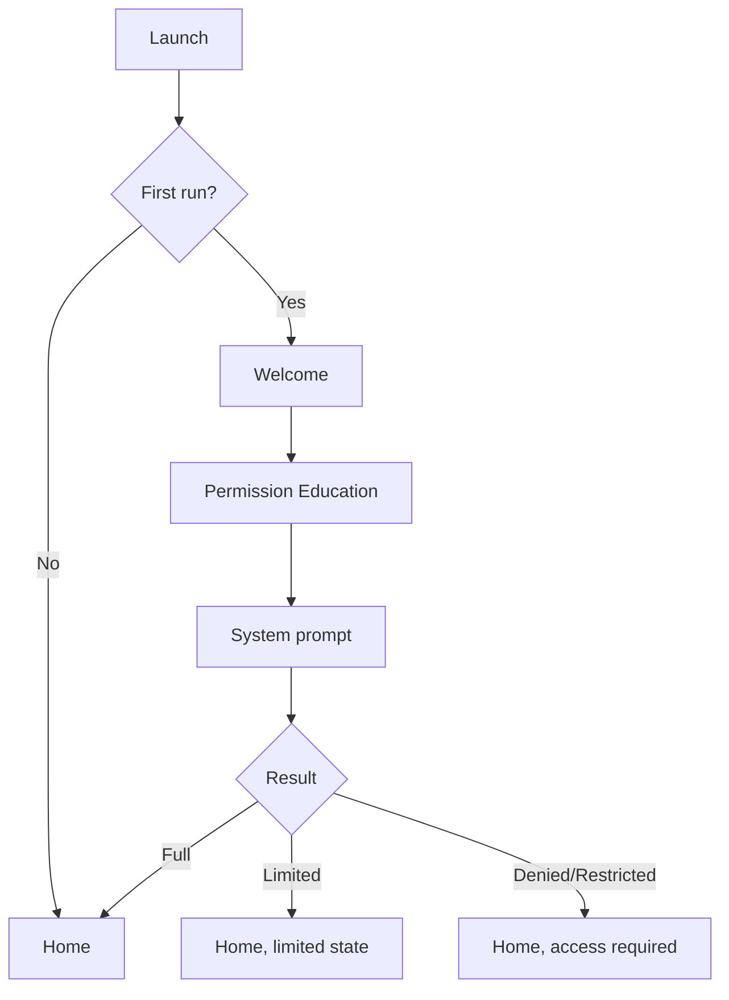
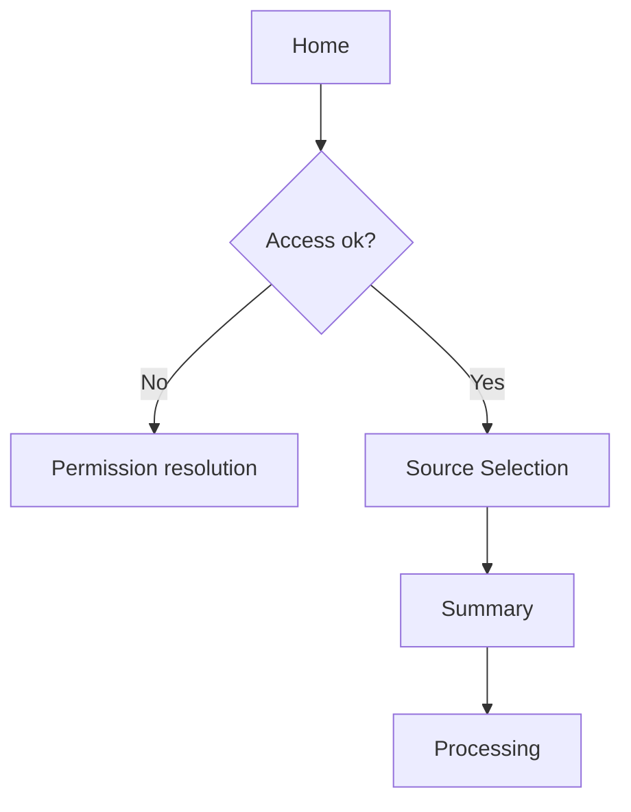
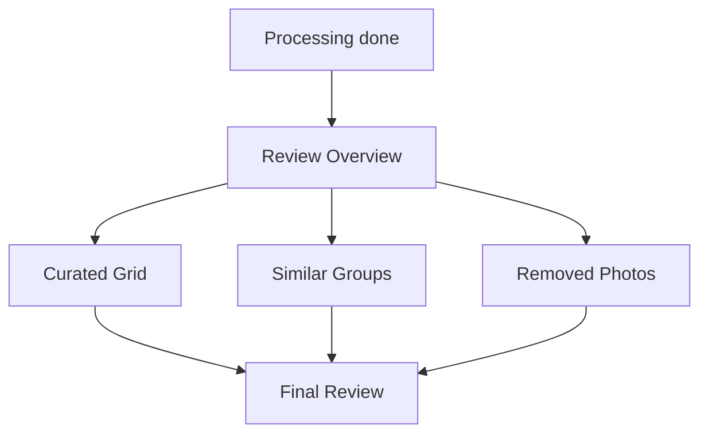
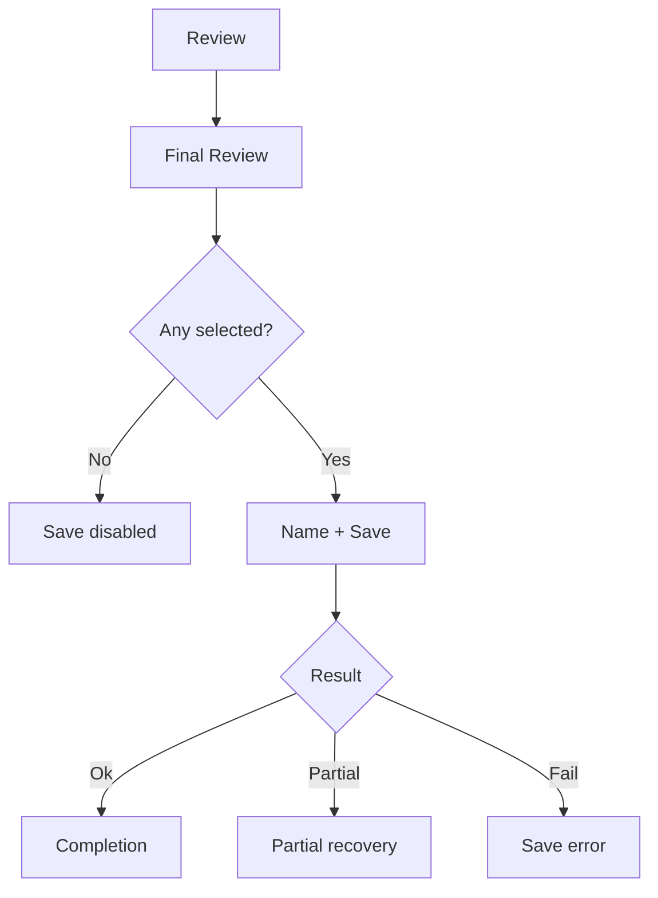

# UX Flows

**Product:** Photos Curator
**Document:** `ux-flows.md`
**Status:** MVP specification
**Last updated:** 2026-09-10
**Primary platform:** iOS (SwiftUI)

**Ownership:** This doc owns user-visible flow, states, copy, and review
behavior only: screens S01–S20, navigation, permission UX copy and
transitions, processing phase labels, review grids/detail/groups,
save/complete, resume and interruption UX, accessibility, and the
user-facing error taxonomy.

**Not owned here (link, do not duplicate):**

- Selection policy (what gets picked and why) → `selection-rules.md`
- Pipeline mechanics (stages, ordering, degradation) → `selection-engine.md`
- Topology, scheduling, concurrency, checkpoints → `ios-architecture.md`
- Stored shapes, session schema, cache validity → `data-model.md`
- PhotoKit / Vision APIs, fetch options, export calls → `apple-frameworks.md`
- Budgets, limits, timing targets → `performance.md`
- Privacy policy, retention, permission policy → `privacy.md`
- QA procedure and walkthrough scripts → `manual-qa.md`
- Analytics events and metrics → `analytics.md`
- Open product decisions → `decision-log.md`

---

## 1. Invariants (MUST only)

These are the only hard rules in this doc. Everything else is guidance.

1. The user decides the final album. The app recommends; the user approves.
2. The MVP flow must not delete original photos from the library (see 01).
3. Removing a photo from the curated album MUST only remove it from the
   current selection, never from the Photos library.
4. Selection state for a session MUST have a single source of truth shared
   by every review surface (grid, detail, groups, removed, final review).
5. A manual user decision (add, remove, change best pick, keep more than one)
   MUST NOT be silently overwritten by later recalculation in the same session.
6. The app MUST NOT present an empty review grid as a normal successful result.
7. The app MUST NOT report a partial save as full success.
8. The system Photos permission prompt is preceded by an in-app
   explanation screen (S03).
9. UI copy avoids deletion language ("delete", "trash", "rejected")
   for non-destructive exclusion from the selection. Use "removed / add back".

---

## 2. Screen inventory and state matrix (read first)

### 2.1 Screen inventory

The MVP has 20 screens/sheets. All are required.

| ID  | Screen                                  | Role in flow                                  |
| --- | --------------------------------------- | --------------------------------------------- |
| S01 | Launch / Session Restore                | Cold start, restore or route to Home          |
| S02 | Welcome / First Run                     | Value statement, first-run only               |
| S03 | Photo Permission Education              | Why-access copy before the system prompt      |
| S04 | Home                                    | Start new curation or continue an old one     |
| S05 | Source Selection                        | Choose the source set for one curation        |
| S06 | Selection Summary / Start               | Checkpoint before expensive processing        |
| S07 | Processing                              | Progress, phase, waiting and leave behavior   |
| S08 | Processing Blocked / Attention Required | Only when processing cannot continue alone    |
| S09 | Review Overview                         | Confidence summary, entry to the three queues |
| S10 | Curated Grid                            | Inspect and prune the selected set            |
| S11 | Photo Detail                            | One photo at useful size, toggle its state    |
| S12 | Similar Group Review                    | Fix best picks group by group                 |
| S13 | Removed Photos                          | Trust surface: everything left out, add-back  |
| S14 | Final Review / Save                     | Final count, album name, explicit save action |
| S15 | Saving                                  | Write progress, no duplicate saves            |
| S16 | Completion                              | Confirm what was saved, clean exit            |
| S17 | Resume Curation                         | Continue card / restored screen after gap     |
| S18 | Settings                                | Access state, privacy note, about             |
| S19 | Photo Access Management Guidance        | Sheet: limited vs denied recovery paths       |
| S20 | Generic Recoverable Error               | Reusable title / body / two-action template   |

There is no account, sync, social, subscription, or editing flow in the MVP.

### 2.2 Screen-level state matrix

Every screen supports a normal state. The table shows which extra states
each screen needs to handle.

| Screen               | Normal | Loading         | Empty                      | Recoverable error    | Permission-gated |
| -------------------- | ------ | --------------- | -------------------------- | -------------------- | ---------------- |
| S02 Welcome          | Yes    | —               | —                          | Rare                 | —                |
| S04 Home             | Yes    | Session restore | No photos in library       | Session load issue   | Yes              |
| S05 Source Selection | Yes    | Picker load     | 0 selected (Continue off)  | Asset load retry     | Yes              |
| S06 Summary          | Yes    | Asset check     | —                          | Validation retry     | Yes              |
| S07 Processing       | Yes    | Core state      | —                          | Yes (→ S08)          | Yes              |
| S09 Review Overview  | Yes    | Result load     | Zero result = abnormal     | Result reload        | Sometimes        |
| S10 Curated Grid     | Yes    | Thumbnails      | Emptied by user (→ S14)    | Thumbnail retry      | Sometimes        |
| S11 Photo Detail     | Yes    | Full image load | —                          | Asset unavailable    | Sometimes        |
| S12 Similar Groups   | Yes    | Group load      | No groups (hide entry)     | Group reload         | Sometimes        |
| S13 Removed Photos   | Yes    | Thumbnails      | Nothing removed            | Thumbnail retry      | Sometimes        |
| S14 Final Review     | Yes    | Preview load    | No selected (Save off)     | Preview retry        | Sometimes        |
| S15 Saving           | Yes    | Core state      | —                          | Yes (retry / finish) | Yes              |
| S16 Completion       | Yes    | —               | —                          | Destination missing  | —                |
| S18 Settings         | Yes    | Permission read | —                          | Rare                 | —                |

Rules that apply across rows:

- Empty is never styled as an error when nothing is wrong.
- One failed thumbnail never blocks a whole grid; use a neutral placeholder.
- Loading that can take minutes uses the Processing screen, not a spinner.

### 2.3 Canonical flow

```text
Launch (S01)
  ↓
Welcome (S02, first run only) → Permission education (S03, first run only)
  ↓
Home (S04)
  ↓
Choose source photos (S05) → Confirm count (S06)
  ↓
Processing (S07, S08 only when blocked)
  ↓
Review Overview (S09)
  ↓
Curated Grid (S10) ⇄ Photo Detail (S11)
  ├─ Similar Groups (S12) ⇄ Photo Detail
  └─ Removed Photos (S13) ⇄ Photo Detail
  ↓
Final Review (S14) → Saving (S15) → Completion (S16)
```

Everything after this section exists to make that path reliable when
permissions, iCloud, interruptions, large inputs, and corrections occur.

---

## 3. Vocabulary

Use these words in UI and code. Do not invent synonyms.

| Term | Meaning |
| ---- | ------- |
| Source photos | Photos the user chose for one curation job |
| Curation / Session | One end-to-end run, with persisted state |
| Curated album | Final set the app recommends and the user approves |
| Selected | Currently included in the curated album |
| Removed | Left out of the album; originals unchanged |
| Similar group | Same-moment images shown together |
| Best pick | Engine-preferred photo inside a group |
| Needs attention | Small set where the choice is uncertain |
| Processing | Analysis and selection work after source choice |
| Save | Create the output album in Apple Photos |

---

## 4. Navigation

### 4.1 Structure

- Home uses a standard `NavigationStack`. Primary action: **Curate Photos**.
  Settings lives in the navigation bar.
- A curation is one focused task: Source → Summary → Processing →
  Review → Final Review → Save → Completion.
- Review drill-downs:

```text
Review Overview (S09)
  ├─ Curated Grid (S10) ─ Photo Detail (S11)
  ├─ Similar Groups (S12) ─ Photo Detail
  └─ Removed Photos (S13) ─ Photo Detail
```

### 4.2 Back

- Before processing starts, Back behaves normally.
- After processing starts, Back never silently destroys the curation.
  Leaving preserves resumable session state; if the build cannot safely
  resume, show the discard confirmation from 4.3 first.

### 4.3 Discard confirmation

Shown for: discard curation, restart analysis when it throws away review
work, replace/merge into an existing output album (if supported).

Title: **Discard this curation?**
Body: "Your original photos will stay unchanged. The current analysis and
selection will be removed."
Actions: **Keep Curation** / **Discard Curation**.

No confirmation for: add photo, remove photo from the album, change best
pick, open detail, return to review.

### 4.4 Reusable components

Keep the set small and prefer native SwiftUI: primary and secondary
buttons, photo thumbnail and selectable thumbnail, photo grid, selection
count badge, progress header, empty-state view, error-state view,
permission-state card, similar-group card, toast/undo banner, album name
field, destructive confirmation dialog.

---

## 5. First run and permissions (S01–S03)

Flow:



Permission policy, retention, and disclosure rules live in
`privacy.md`. API details live in
`apple-frameworks.md`. This section covers only copy,
order, and transitions.

### 5.1 S02 — Welcome (first run only)

One screen, no carousel. Product name, one visual, value line, and
**Get Started** → S03.

> Turn hundreds of photos into a small, polished album.

Supporting points (max three): finds the best shots; trims similar
photos; you stay in control of the final album.

### 5.2 S03 — Permission education (before the system prompt)

Title: **Choose photos for curation**
Body: "Photos Curator needs access to the photos you choose so it can
analyze them and build your curated album."
When all analysis in the build is on-device, append:
"Photo analysis happens on this iPhone."
Actions: **Continue** (requests system permission) / **Not Now**
(returns to Home in the access-required state below).

### 5.3 Permission outcomes (user-visible)

- **Full:** Home, normal.
- **Limited:** Home, normal. Limited is a valid state, not an error. Show
  **Limited Photos Access** only where it matters (source selection), with
  the system path to choose more photos.
- **Denied:** Home shows an access-required card. Title: **Photos Access
  Needed**. Body: "Allow photo access to choose images for curation."
  Action: **Open Settings**. Never show a dead **Curate Photos** button
  that fails on tap.
- **Restricted:** "Photos access is restricted on this device." Do not
  repeat prompts. Offer **Open Settings** only when it can help.
- **Revoked later:** do not crash on session restore. Pause dependent work,
  mark inaccessible assets, show the attention state, and offer restore
  access or discard. Recheck permission automatically when the app returns
  from Settings; do not require relaunch.

---

## 6. Home and source selection (S04–S06)

Flow:



### 6.1 S04 — Home

Default: product title, one-line explanation ("Pick a trip, event, or
batch of photos. Photos Curator will find the strongest set for you to
review."), **Curate Photos**, settings button.

With one unfinished session: **Continue Curation** card showing source
count, current stage, and last activity time, plus **Continue** and
**Start New**. When only one active session is supported, **Start New**
asks whether to discard the previous curation first.

With denied access: the access-required card from 5.3 replaces the CTA.

With access but zero photos: **No Photos Available** — "Add photos to
your library or allow access to more photos, then try again." Actions:
**Choose More Photos** (limited) and **Try Again**.

### 6.2 S05 — Source selection

Goal: choose the source set, not the final album. Prefer the familiar
Apple picker patterns over a custom browser.

Show throughout: number selected, reassurance that originals are not
changed, and practical batch guidance. Example header: **842 photos
selected** with "Photos Curator will analyze these photos and propose a
smaller album."

- Zero selected: Continue stays disabled, no alert.
- One photo: allowed; optional hint "Photos Curator works best with a
  larger set." No arbitrary minimum.
- Inaccessible assets (permission changed): never silently count them as
  processable. The summary uses the processable count or labels pending
  items.
- Hard limits (if any) are communicated before processing, e.g. "This
  version can process up to 5,000 photos at once." Exact numbers live in
  `performance.md`; this doc owns only the message placement.

### 6.3 S06 — Summary / Start (checkpoint before expensive work)

Example: **Ready to curate 842 photos**. Supporting lines: "We'll group
similar shots, evaluate photo quality, and build a smaller selection for
you to review." Append "Analysis happens on this iPhone." only when true
for the build, and "Some photos may need to download from iCloud." when
relevant. Never show a time estimate without reliable data; prefer "This
may take a while for large libraries."

Actions: **Start Curation** (persist session, freeze source identifiers,
go to Processing immediately, stay responsive) and **Change Photos**
(back to S05).

---

## 7. Processing (S07–S08)

User-facing phases (stable labels; they do not map 1:1 to engine stages):

1. **Preparing photos**
2. **Analyzing photos**
3. **Grouping similar shots**
4. **Choosing the best photos**
5. **Finishing your album**

Stage internals live in `selection-engine.md`; scheduling and
background rules in `ios-architecture.md`; fetch behavior in
`apple-frameworks.md`; timing budgets in
`performance.md`. This section covers only what the user sees.

### 7.1 S07 — Processing screen

Required: title (**Curating your photos**), progress indicator, current
phase (**Finding the best shots** style), processed/total count when it
has a real denominator (`318 of 842 analyzed`), leave behavior, and a
stop/discard path.

- Determinate progress when the denominator is real; indeterminate when
  the phase cannot be quantified (iCloud fetch, final grouping).
- Progress never moves backward without an on-screen explanation.
- After termination, resume shows the persisted completed count instead
  of resetting to zero when the build supports it.
- When visibly stalled, keep phase messaging alive and name the blocker:
  **Waiting for 24 photos from iCloud** — "Keep this iPhone connected to
  the internet." Never animate a fake percentage.
- Leaving: "You can leave this screen. We'll keep your progress and
  resume if needed." Never promise background execution the build cannot
  guarantee (see `ios-architecture.md`).
- Stop is optional. When present, separate **Pause / Stop Processing**
  (keeps the session) from **Discard Curation** (deletes session progress).
- On return from lock or background: restore the view, reconcile real
  engine progress, resume without redoing finished work.
- Resource pauses use plain words: **Curation Paused** — "Your progress
  is saved. Curation will continue when the app is active again." No
  mention of memory pressure, Metal, or task cancellation.

### 7.2 iCloud and unavailable assets (user-visible)

- Silent fetch: fold into processing as **Downloading photos from
  iCloud** with a remaining count.
- No network: **Some Photos Need iCloud** — "Connect to the internet to
  download the remaining photos." Actions: **Try Again**, plus **Continue
  Without Them** only when partial processing is a supported product rule
  (thresholds live in `selection-engine.md`).
- Missing assets (deleted or edited mid-job): skip, count as unavailable,
  continue when safe, and summarize before review:
  **3 photos were unavailable and could not be analyzed.**

### 7.3 S08 — Blocked / attention (only when work cannot continue alone)

Structure: plain title, one-sentence cause, primary recovery action,
optional secondary action, progress-safety note. No error codes in copy.

| Condition | Primary | Secondary |
| --------- | ------- | --------- |
| Permission removed | Open Settings | Discard Curation |
| iCloud needs network | Try Again | Continue Without Them (if allowed) |
| Temporary load failure | Retry | Return Home |
| Storage too low | Free Up Space / Retry | Return Home |
| Session data unusable, source IDs kept | Restart Analysis | Discard |
| Other recoverable failure | Retry | Return Home |

Retry resumes failed work; it does not throw away finished analysis.
After repeated failure, always offer a stable exit (Return Home /
Discard). Diagnostics stay internal.

---

## 8. Review (S09–S13)

Review answers three questions: what did the app choose, what did it
leave out, and where is a decision genuinely useful. Default review never
requires re-inspecting every source photo. No raw scores appear in the
primary UI. What counts as duplicate, moment, best pick, or diverse is
defined in `selection-rules.md`; this section defines only how
those outcomes are shown and corrected.



Interaction rules (apply everywhere):

- Single shared selection state; counts stay consistent across grid,
  detail, groups, removed, and final review.
- `selected + removed = processable source assets`, plus an explicit
  unavailable bucket when assets went missing. The equation stays
  internal; the UI simply never contradicts itself.
- Manual edits win for the session and survive navigation; reprocessing
  preserves them when technically straightforward.
- The final album defaults to chronological capture order so edits do not
  reshuffle unrelated photos.
- Internal classes (exact / near-duplicate / burst / same-moment) all
  render as **Similar Photos** unless a finer label helps a decision.
- Group photos, scenery, and people need no special modes; they surface
  through best picks, groups, and the single mixed album.

### 8.1 S09 — Review Overview

Example: **Your curated album is ready** — **126 selected from 842
photos**, plus compact stats (not selected, groups worth reviewing).
Sections: Selected Photos (**Review Selection**), Similar Photos /
Needs Attention (**Review Similar Photos**, hidden when empty), Removed
Photos (**Review Removed**). Primary action **Review & Save** opens the
Curated Grid first so users see the album before saving.

Zero-result safety: **We couldn't build a selection** — "Try processing
this set again or choose different photos." Actions: Retry / Choose
Different Photos.

### 8.2 S10 — Curated Grid

Performant grid (consistent thumbnails, lazy load, kept scroll position)
with a persistent **126 selected** count. Every photo here is included.

- Remove via a visible checkmark control (tapping the photo itself opens
  detail; the checkmark never opens detail). Removed items dim in place
  rather than vanishing and shifting the layout mid-review.
- Single-item removal offers lightweight undo: **Removed from album —
  Undo**. No multi-level history. No MVP multi-select or advanced
  filters; Selected / Removed filters are enough.

### 8.3 S11 — Photo Detail

Back, large photo, **In Album** / **Removed** toggle (checkmark state, no
trash icon), previous/next inside the current context, optional compact
info (date, location when authorized). Pinch zoom and horizontal swipe
allowed; vertical swipe does nothing destructive. No AI metrics. An
optional "why selected" line uses high-level reasons only (sharpest in
group, better expression, adds variety) and never claims certainty the
model cannot support.

### 8.4 S12 — Similar Group Review

Per group: best pick marked **Recommended best pick**, alternatives,
included state, and count (**1 selected from 5 similar photos**). The
user can keep the pick, choose another, keep more than one, or remove
all; nothing forces exactly-one unless the rule is strict duplicates per
`selection-rules.md`. Primary group action: **Keep Best Pick**;
the rest happens on thumbnails. Between groups show `4 of 18`; at the
end: **Similar photos reviewed** with **Back to Review**.

Correction flow: open group → tap another photo → it becomes included,
the old pick becomes removed unless kept explicitly → state persists on
return and at save.

### 8.5 S13 — Removed Photos

Title **Removed Photos** with "These photos are not in your curated
album. Your originals are unchanged." Each photo has **Add**; adding
updates the count at once, confirms subtly, and keeps grid position.
Reason labels (similar / lower quality / redundant) are optional and
never call a photo "bad". Large removed sets lazy-load thumbnails and
never build full-resolution state eagerly.

---

## 9. Final review, save, completion (S14–S16)



Export mechanics live in `apple-frameworks.md`. This
section covers checkpoints, copy, and completion UX.

### 9.1 S14 — Final Review

Required: selected count (**126 photos ready**), small preview, output
destination, editable album name (default: source name + "Curated", or
date range, or "Curated Photos"; no AI trip naming), **Save Album**, and
**Back to Review**. Note near the action: "Your original photos will not
be changed." Empty selection disables Save with **Add at least one photo
to save this album.** Duplicate names never block: create a
collision-safe album or explicitly ask to reuse an existing one
(prefer the former).

### 9.2 S15 — Saving

Title: **Saving your album** with determinate progress when reliable
(`84 of 126 added`). Disable Save once writing starts and persist enough
state to reconcile an interrupted save, so re-entry never creates a
duplicate album.

- Permission lost mid-save: **Can't Save Album** — "Photos access
  changed before the album could be saved." Actions: **Open Settings** /
  **Back to Review**. Keep the final selection.
- Partial write: **Album partially saved** — "108 of 126 photos were
  added." Actions: **Retry Remaining** / **Finish Anyway** (only when the
  partial result is usable). Retry adds only missing assets.

### 9.3 S16 — Completion

Title: **Album Saved** with count and album name. Actions: **View in
Photos** (only when a reliable deep link exists, otherwise omit),
**Done** (mark completed, return Home), optional **Curate More Photos**.
Cleanup of temporary data follows `privacy.md`.
Session history is not an MVP feature.

---

## 10. Resume and interruption (S17)

Ideal resume points: processing, attention state, review, final review,
partial save. State machines and persistence live in
`ios-architecture.md` and `data-model.md`; this section defines
the visible behavior.

On launch with an unfinished session: interrupted processing restores
directly to Processing; review sessions show a Home **Continue Curation**
card unless direct restoration is reliable; interrupted saves reconcile
before offering any action. Before restoring, the app checks readable
metadata, enough surviving source identifiers, compatible permission, and
valid cached analysis, else routes to a recoverable state. After an app
update with an incompatible schema: migrate when simple, else keep source
identifiers and offer **Restart Analysis**, never crash on decode.

| Interruption | Visible behavior |
| ------------ | ---------------- |
| Background during selection | Return to picker state |
| Background / lock during processing | Progress saved, safe resume |
| Termination / force-quit | Restore persisted session, no re-selection |
| Call or transient gap | No effect |
| Network lost, local-only assets | Continue |
| Network lost during iCloud fetch | Waiting / attention state |
| Permission removed | Pause, request resolution |
| Sources deleted externally | Mark unavailable, continue when safe |
| Low disk space | Keep progress, ask for action |
| Save interrupted | Reconcile first, then retry without duplicates |

---

## 11. Settings and access management (S18–S19)

Minimal. Sections: Photos Access (Full / Limited / Denied + **Manage
Photos Access**), Processing & Privacy (informational line such as
"Photo analysis is performed on this device." only when true for the
build; full policy in `privacy.md`), About (version,
privacy policy, help when available). No MVP toggles for ranking
weights, thresholds, models, cache, or thread counts.

S19 is a sheet, not a full flow. Limited: "Photos Curator can only use
the photos currently shared with the app." with **Choose More Photos**
via the Apple flow. Denied: "Photo access is turned off. Enable it in
Settings to curate photos." with **Open Settings**. Full access shows no
warning.

---

## 12. Generic states

### 12.1 Loading

Short waits only: album lists, thumbnails, session restore, permission
reads. Skeleton placeholders for grids, spinner for short blocks, never
a full-screen spinner for minute-long work.

### 12.2 Empty states

| Context | Message | Action |
| ------- | ------- | ------ |
| No accessible photos | No Photos Available | Choose More Photos / Try Again |
| Nothing selected yet | Select photos to continue | Continue disabled |
| No similar groups | No similar groups need review | Back to Review |
| Nothing removed | Nothing removed | Back to Review |
| Nothing selected at save | Add at least one photo | Back to Review |
| No resumable session | Normal Home | Curate Photos |

### 12.3 User-facing error taxonomy (S20 template)

Group errors by what the user can do, not by cause:

- **Auto-retry, no alert:** transient fetch failure, brief cancellation.
- **User action needed:** denied permission, no network for iCloud, low
  storage. Explain the action, keep the session.
- **Restart work:** corrupt cache or incompatible analysis. **Restart
  Analysis**, keep source selection when possible.
- **Session unusable:** **This curation can't be restored** — "Your
  original photos are unchanged. Start a new curation to try again."
  Actions: Start New Curation / Return Home.
- **Fatal startup:** only when Home itself cannot load. No stack traces,
  paths, model names, or exception text.

S20 structure for every case: plain title, one line on what happened and
whether progress is safe, primary recovery action, safe-exit secondary.
Example: **Couldn't Continue Curation** — "Your progress is saved. Try
again to continue processing." Actions: Try Again / Return Home.

---

## 13. Copy and accessibility

Tone: calm, short, confident without certainty, non-technical, respectful
of ownership. Say "We found 18 similar groups to review." and "Removed
from album", not "AI detected 18 redundant clusters" or "Rejected". The
app can say "Photos Curator selected 126 photos." Never claim it knows
which memories matter. Never show numeric confidence; route uncertainty
to **Needs Attention** or Similar Groups.

Accessibility is MVP quality: Dynamic Type without clipped controls;
VoiceOver labels on every photo action ("Photo, September 4, selected",
"Remove from curated album", "Add to curated album", "Recommended best
pick"), never color-only state (use icon, border, checkmark, text);
Reduce Motion respected; primary controls meet iOS tap-target sizes.

---

## 14. Non-goals

The MVP review and flow surface stays focused on selection. Out of scope
unless the PRD adds them: accounts, sync, sharing networks, AI chat,
ratings, tags, search, maps, deletion of originals, storage-cleaner
flows, face identity or people naming, editing or filters, video
editing, books, desktop companion, parallel curation jobs, session
history, scoring-weight controls, debug score views, long onboarding
carousels, gamified swiping, test-only screens.

---

## 15. Acceptance checklist

Release-ready when each item below holds. Procedure and scripts live in
`manual-qa.md`.

- First run: system prompt follows S03; full, limited, and denied each
  have a working path; permission changes on return are rechecked.
- Source: large sets selectable; zero selection blocks Start; count
  visible; originals-safety stated; any hard limit messaged early.
- Processing: starts at once after Start; phase and progress visible;
  UI responsive; backgrounding and termination restore safely; iCloud
  waits and errors visible; retries keep finished work; no unsupported
  background promises.
- Review: selected set visible; remove, add-back, detail inspect, and
  best-pick override all work; edits persist across screens; counts
  agree; no deletion language.
- Save: final count and editable name shown; empty save blocked; double
  taps create one album; interrupted saves reconcile; partial never
  reported as full; completion matches the Photos output.
- Safety: originals untouched; privacy lines match the build; no raw
  scores, embeddings, or identity claims in UI; temp data follows the
  retention rules in `privacy.md`.
- Access: Dynamic Type, VoiceOver state and actions, non-color state,
  tap targets, Reduce Motion all hold on the main flow.

---

## 16. Links and Uncertain

Normative detail lives with its owner:

- `product.md`, `selection-rules.md`,
  `selection-engine.md`, `ios-architecture.md`,
  `data-model.md`, `apple-frameworks.md`,
  `performance.md`, `privacy.md`,
  `manual-qa.md`,
  `analytics.md`, `roadmap.md`.

Uncertain: open UX questions are not resolved here. Anything undecided
about wording, thresholds that surface in copy, save-destination choice,
partial-processing support, or session-history scope is recorded in
`decision-log.md` and linked from the owning doc above.
