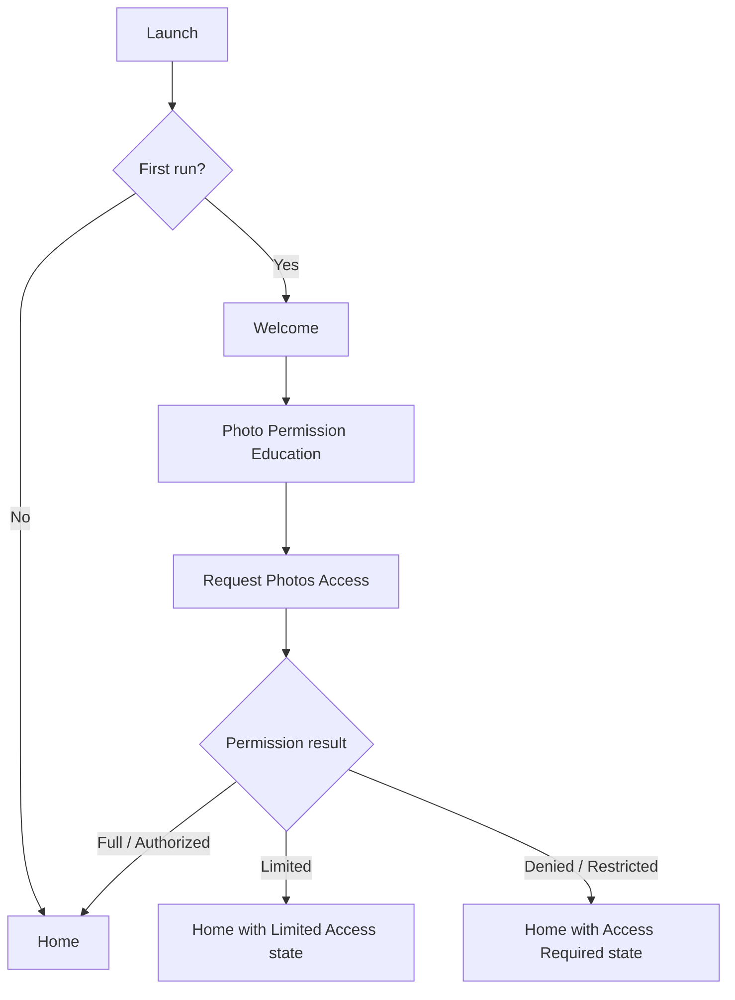
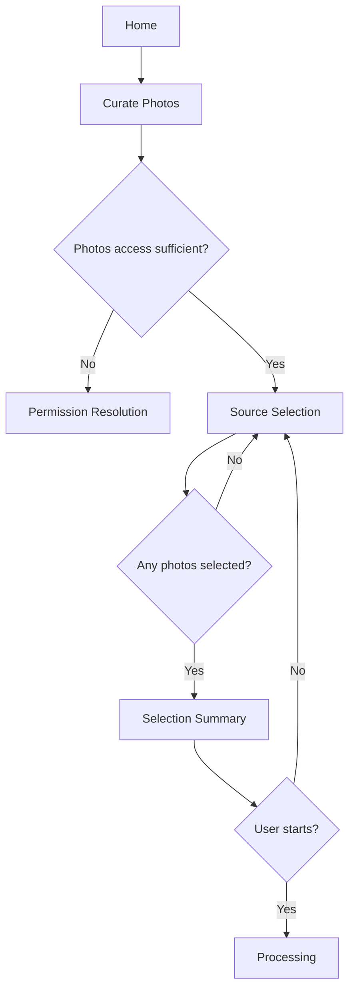
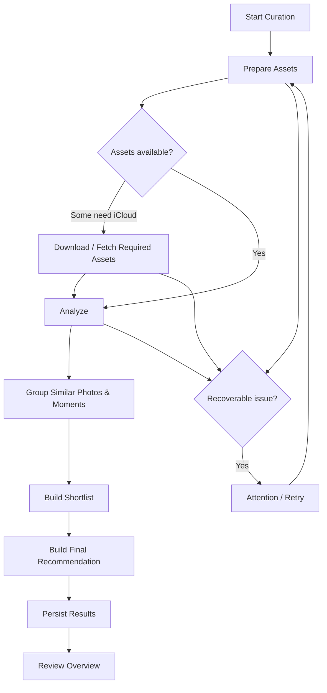
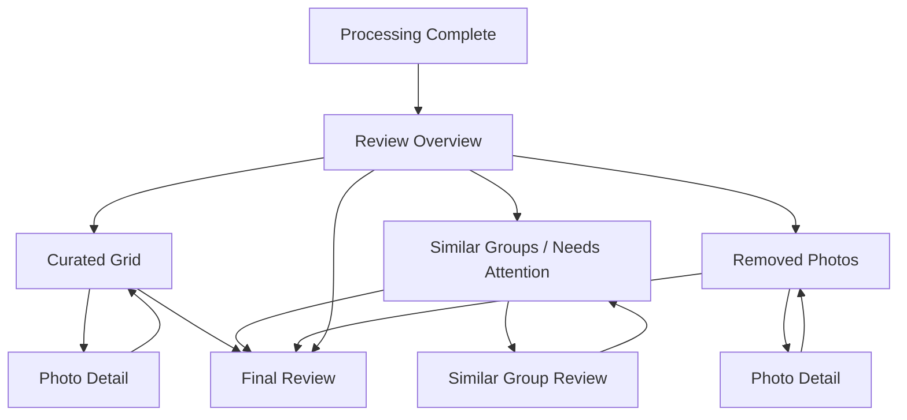
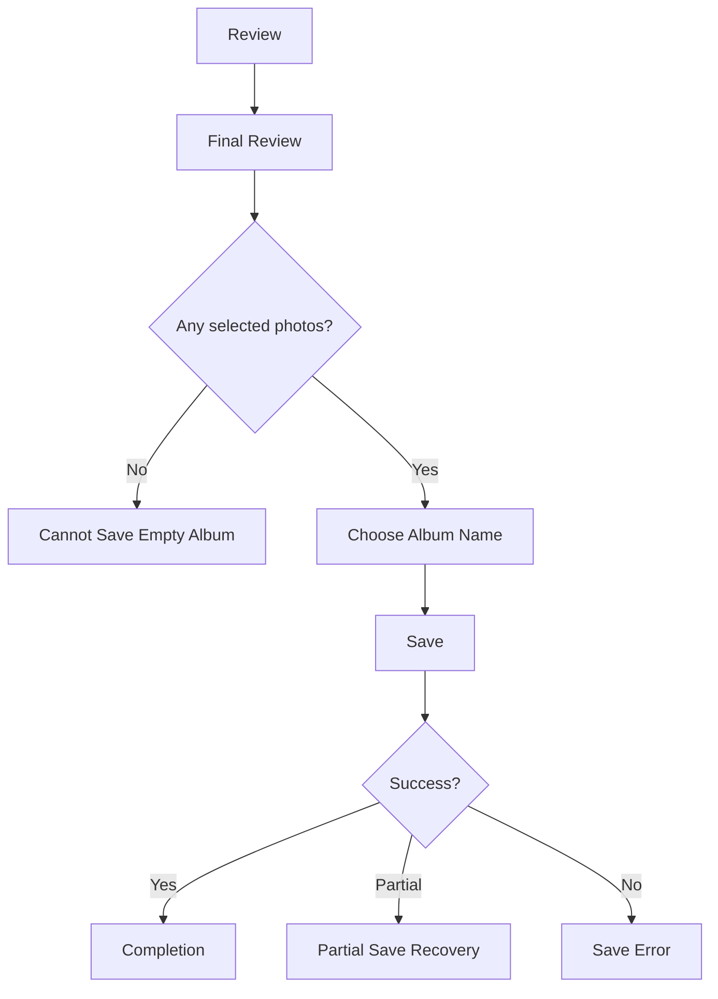
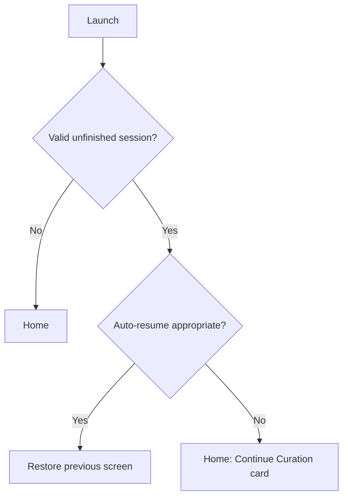

# 02 — UX Flows

**Product:** Photos Curator  
**Repository / working name:** `photos-curator`  
**Document:** `02_UX_Flows.md`  
**Status:** MVP specification  
**Last updated:** 2026-09-10  
**Primary platform:** iOS  
**UI framework:** SwiftUI  
**Related documents:** `01_PRD.md`, `03_Photo_Selection_Rules.md`, `04_Selection_Engine_Design.md`, `07_Apple_Framework_Integration.md`, `08_Performance_Spec.md`, `09_Privacy_and_Permissions.md`, `10_Manual_QA_and_Selection_Evaluation.md`, `11_Analytics_and_Metrics.md`

---

## 1. Purpose

This document defines the complete user experience for the MVP of Photos Curator.

It describes:

- the app's information architecture;
- every MVP screen;
- primary and secondary user flows;
- navigation behavior;
- permissions;
- loading and processing states;
- empty states;
- error and recovery states;
- interruption and resume behavior;
- review and editing interactions;
- save/export behavior;
- UX requirements that the implementation must satisfy.

This is an implementation-oriented specification. A developer should be able to build the app's navigation and screen states without inventing major product behavior.

Detailed ranking logic does **not** belong here. Selection heuristics, duplicate rules, moment grouping, diversity rules, and scoring belong in `03_Photo_Selection_Rules.md` and `04_Selection_Engine_Design.md`.

---

## 2. UX Scope

### 2.1 MVP goal

The MVP should let a user go from a large set of photos to a curated album with as little effort as possible.

The core journey is:

> **Choose photos → let the app analyze them → review a curated selection → make small corrections → save the final album.**

The app should feel substantially easier than manually reviewing hundreds or thousands of photos.

### 2.2 UX principles

The MVP follows these principles.

#### 2.2.1 The app does the first pass

The user should not be forced to make hundreds of individual decisions.

The selection engine performs the initial curation. The user mainly reviews exceptions.

#### 2.2.2 Preserve user control

The system recommends; the user decides.

The user must always be able to:

- add a photo back;
- remove a selected photo;
- change the preferred photo within a similar-photo group;
- abandon a curation without modifying the Photos library;
- review the final set before saving.

#### 2.2.3 No destructive actions by default

The MVP does not delete original photos.

Removing a photo from the curated album only removes it from the app's current selection.

If deletion of originals is ever added, it must be a separate future flow with explicit confirmation.

#### 2.2.4 Privacy should be obvious

The UI should make clear that photo analysis is performed on-device whenever this is true for the implemented pipeline.

Do not repeatedly show privacy claims on every screen. Communicate it at the moments where the user is deciding whether to grant access or start analysis.

#### 2.2.5 Large jobs should feel understandable

Processing 1,000+ photos can take time.

The app must communicate:

- that work is progressing;
- what general phase is running;
- that the user can leave the screen when safe;
- whether progress can resume after interruption;
- what to do when some assets require iCloud download.

Avoid fake precision.

#### 2.2.6 Review should be visual, not analytical

Do not expose raw AI scores in the primary interface.

Users should see understandable concepts such as:

- Best picks
- Similar photos
- Added
- Removed
- Needs attention

Internal values such as blur score, face score, similarity distance, or aesthetic score are implementation details.

#### 2.2.7 Optimize for one-handed, low-friction use

Important actions should be reachable from standard iPhone interaction patterns.

The primary flow should not depend on hidden gestures.

Gestures may accelerate actions, but visible controls must exist for all important operations.

---

## 3. Product Vocabulary

Use consistent terminology in UI and code.


| Term                | Meaning                                                                                          |
| ------------------- | ------------------------------------------------------------------------------------------------ |
| **Source photos**   | Photos selected by the user for one curation job                                                 |
| **Curation**        | One end-to-end processing session                                                                |
| **Curated album**   | Final set recommended by the app and approved by the user                                        |
| **Selected**        | Currently included in the curated album                                                          |
| **Removed**         | Excluded from the curated album but never deleted from the Photos library                        |
| **Similar group**   | Near-duplicate or same-moment images presented together                                          |
| **Best pick**       | Photo preferred by the engine within a group or moment                                           |
| **Needs attention** | A small set where automatic choice is uncertain or user review is valuable                       |
| **Processing**      | Analysis and selection work performed after source selection                                     |
| **Save**            | Create/update the resulting album in Apple Photos or complete the app's configured output action |
| **Session**         | Persisted state of an unfinished or completed curation                                           |


Avoid using "delete" when the action only removes an image from the curated selection.

---

## 4. Information Architecture

The MVP should remain intentionally small.

### 4.1 Top-level structure

There are three logical areas:

1. **Home**
2. **Curation flow**
3. **Settings**

The curation flow is modal or navigation-stack driven and should feel like one focused task.

### 4.2 MVP screen inventory


| ID  | Screen                                  | Required |
| --- | --------------------------------------- | -------- |
| S01 | Launch / Session Restore                | Yes      |
| S02 | Welcome / First Run                     | Yes      |
| S03 | Photo Permission Education              | Yes      |
| S04 | Home                                    | Yes      |
| S05 | Source Selection                        | Yes      |
| S06 | Selection Summary / Start               | Yes      |
| S07 | Processing                              | Yes      |
| S08 | Processing Blocked / Attention Required | Yes      |
| S09 | Review Overview                         | Yes      |
| S10 | Curated Grid                            | Yes      |
| S11 | Photo Detail                            | Yes      |
| S12 | Similar Group Review                    | Yes      |
| S13 | Removed Photos                          | Yes      |
| S14 | Final Review / Save                     | Yes      |
| S15 | Saving                                  | Yes      |
| S16 | Completion                              | Yes      |
| S17 | Resume Curation                         | Yes      |
| S18 | Settings                                | Yes      |
| S19 | Photo Access Management Guidance        | Yes      |
| S20 | Generic Recoverable Error               | Yes      |


There is no separate account, cloud sync, social, profile, or subscription flow in the MVP unless explicitly added by the PRD later.

---

## 5. Global Navigation Model

### 5.1 Home navigation

Use a standard `NavigationStack`.

Home contains the primary call to action:

**Curate Photos**

A settings button may appear in the navigation bar.

### 5.2 Curation navigation

Once a curation begins, preserve a single session object and navigate through:

```text
Source Selection
      ↓
Selection Summary
      ↓
Processing
      ↓
Review
      ↓
Final Review
      ↓
Save
      ↓
Completion
```

Review contains drill-down screens:

```text
Review Overview
 ├─ Curated Grid
 │   └─ Photo Detail
 ├─ Similar Group Review
 │   └─ Photo Detail
 └─ Removed Photos
     └─ Photo Detail
```

### 5.3 Back behavior

Before processing starts, Back behaves normally.

After processing starts:

- Back must not silently destroy the curation.
- Leaving the curation should either preserve resumable session state or show a discard confirmation if the current implementation cannot safely resume.
- The preferred MVP behavior is to persist the session and allow the user to return later.

### 5.4 Cancel behavior

If the user explicitly chooses **Discard Curation**:

1. show a confirmation;
2. explain that original photos will not be affected;
3. delete only temporary app/session data;
4. return to Home.

Suggested confirmation:

**Discard this curation?**

"Your original photos will stay unchanged. The current analysis and selection will be removed."

Actions:

- Keep Curation
- Discard Curation

---

## 6. Application State Model

The UX should be driven by explicit state rather than scattered booleans.

Recommended conceptual state:

```text
AppState
 ├─ needsOnboarding
 ├─ ready
 ├─ hasResumableSession
 └─ fatalStartupError

CurationState
 ├─ choosingSource
 ├─ readyToProcess
 ├─ processing
 ├─ processingPaused
 ├─ processingNeedsAttention
 ├─ review
 ├─ readyToSave
 ├─ saving
 ├─ completed
 └─ failedRecoverably
```

The actual Swift types are defined elsewhere. The UX requirement is that a session has one clear state and deterministic destination.

---

# PART I — FIRST RUN AND PERMISSIONS

## 7. Flow A — First Launch

### 7.1 Goal

Explain the product quickly, establish trust, and request Photos access only when the user understands why it is needed.

### 7.2 Flow



### 7.3 S02 — Welcome / First Run

#### Purpose

Communicate value before requesting access.

#### Required content

- Product name
- Short value statement
- One simple visual or icon
- Primary CTA: **Get Started**

Suggested product message:

> Turn hundreds of photos into a small, polished album.

Optional supporting points:

- Finds the best shots
- Reduces duplicates and similar photos
- Keeps you in control of the final album

Do not present a multi-page onboarding carousel unless later evidence shows it is necessary.

#### Exit

**Get Started** → S03 Photo Permission Education.

---

## 8. Flow B — Photos Permission

### 8.1 Permission principle

Do not trigger the system Photos permission prompt immediately on launch.

Show S03 first.

### 8.2 S03 — Photo Permission Education

#### Content

Title:

**Choose photos for curation**

Body:

"Photos Curator needs access to the photos you choose so it can analyze and build your curated album."

If the pipeline is fully on-device, add:

"Photo analysis happens on this iPhone."

Primary CTA:

**Continue**

Secondary CTA:

**Not Now**

#### Continue

Tapping Continue requests the appropriate Apple Photos permission.

#### Not Now

Return to Home in an access-required state. The app remains usable enough to explain its purpose and offer another permission attempt.

### 8.3 Permission outcomes

#### Full / authorized access

Proceed to Home.

#### Limited access

Proceed to Home.

The app must support limited access instead of treating it as an error.

Show a subtle status only when relevant:

**Limited Photos Access**

When the user opens Source Selection, allow them to use available assets and provide the system-supported path for choosing more photos.

#### Denied

Home should display an access-required card.

Title:

**Photos Access Needed**

Body:

"Allow photo access to choose images for curation."

CTA:

**Open Settings**

A secondary educational action may explain why access is needed.

#### Restricted

If access is restricted by system policy, do not repeatedly request permission.

Explain:

"Photos access is restricted on this device."

Provide **Open Settings** only if it can lead to a meaningful resolution.

### 8.4 Permission revoked later

If access was previously granted and later removed:

- do not crash when restoring a session;
- mark inaccessible assets;
- show an attention state;
- allow the user to restore access or discard the session.

Detailed PhotoKit behavior belongs in `07_Apple_Framework_Integration.md`.

---

# PART II — HOME AND SOURCE SELECTION

## 9. S04 — Home

### 9.1 Goal

Start a new curation or resume an unfinished one.

### 9.2 Default Home

Required elements:

- Product title
- Primary CTA: **Curate Photos**
- Short explanation
- Settings button

Optional supporting message:

> Pick a trip, event, or batch of photos. Photos Curator will find the strongest set for you to review.

### 9.3 Home with resumable session

If one unfinished session exists, show:

**Continue Curation**

with a compact summary:

- source photo count;
- current stage;
- last activity time, if useful.

Primary CTA: **Continue**

Secondary CTA: **Start New**

If the MVP supports only one active session, tapping Start New while an unfinished session exists must ask whether to discard the previous curation.

### 9.4 Home with permission denied

Primary content becomes the access-required card described above.

Do not show a dead **Curate Photos** button that fails after tap.

### 9.5 Empty library

If Photos access exists but there are no accessible photos:

Title:

**No Photos Available**

Body:

"Add photos to your library or allow access to more photos, then try again."

Available actions depend on the permission mode:

- **Choose More Photos**, for limited access where supported;
- **Try Again**.

---

## 10. Flow C — Start New Curation



---

## 11. S05 — Source Selection

### 11.1 Goal

Let the user choose the photos included in one curation.

The MVP should prioritize using Apple's familiar photo-selection patterns rather than building a complex custom library browser unless a custom browser is required for performance or batch-selection reasons.

### 11.2 Selection strategies

At minimum, the user must be able to select a batch of photos.

Useful input patterns include:

- a user-selected set of assets;
- photos from a Photos album;
- a date/event range if later implemented.

Do not require the user to manually select exactly the desired final album. This screen defines the **source set**, not the final set.

### 11.3 Visible information

The screen or picker wrapper should communicate:

- number selected;
- that the originals will not be changed;
- practical guidance for the expected batch size.

Example:

**842 photos selected**

"Photos Curator will analyze these photos and propose a smaller album."

### 11.4 Selection limits

The UX must distinguish:

- **recommended range**;
- **supported hard limit**, if one exists.

Do not arbitrarily block 1,001 photos if the engine supports more.

If the MVP has a temporary hard limit, communicate it before processing.

Example:

**Too many photos selected**

"This version can process up to 5,000 photos at once. Select fewer photos to continue."

The exact supported limits come from `08_Performance_Spec.md`.

### 11.5 Zero selection

Disable Continue.

No error alert is needed.

### 11.6 One photo selected

The app may allow this technically, but it provides little curation value.

Preferred UX:

- allow the user to continue if engine behavior is valid;
- do not create an arbitrary minimum unless required.

A lightweight hint may say:

"Photos Curator works best with a larger set."

### 11.7 Inaccessible assets

If an asset is visible in the library but unavailable to the app due to permission changes, it should not silently count as processable.

The selection summary must use the number of assets the app can actually process or clearly label pending items.

---

## 12. S06 — Selection Summary / Start

### 12.1 Goal

Give the user one clear checkpoint before potentially expensive processing begins.

### 12.2 Required content

Example:

**Ready to curate 842 photos**

Supporting copy:

"We'll group similar shots, evaluate photo quality, and build a smaller selection for you to review."

If processing is on-device:

"Analysis happens on this iPhone."

If iCloud downloads may be required:

"Some photos may need to download from iCloud."

### 12.3 Primary CTA

**Start Curation**

### 12.4 Secondary action

**Change Photos**

### 12.5 Optional estimates

Do **not** show a time estimate unless the app has sufficiently reliable runtime data.

Prefer:

"This may take a while for large libraries."

over:

"About 3 minutes"

when timing is unpredictable.

### 12.6 Start action

When the user taps Start Curation:

1. create/persist the curation session;
2. freeze the source asset identifiers for that session;
3. navigate immediately to Processing;
4. begin analysis.

The UI must not appear unresponsive while session creation begins.

---

# PART III — PROCESSING

## 13. Flow D — Processing



The exact internal pipeline may differ. User-facing phases should remain stable enough to communicate progress without exposing implementation details.

---

## 14. S07 — Processing

### 14.1 Goal

Keep the user informed while the selection engine works.

### 14.2 Required content

- title;
- progress indicator;
- current high-level phase;
- processed / total count when meaningful;
- safe-leave behavior;
- cancellation or exit behavior.

Example:

**Curating your photos**

`318 of 842 analyzed`

Current phase:

**Finding the best shots**

### 14.3 User-facing phases

Recommended labels:

1. **Preparing photos**
2. **Analyzing photos**
3. **Grouping similar shots**
4. **Choosing the best photos**
5. **Finishing your album**

These labels should not map 1:1 to every internal operation.

### 14.4 Progress behavior

Use determinate progress when there is a meaningful denominator.

Use indeterminate progress when:

- the next phase cannot be quantified;
- PhotoKit/iCloud work has unpredictable duration;
- final clustering/finalization has no stable item count.

Progress must never move backward unless the UI explicitly explains a restarted phase.

A processing restart after app termination may show the persisted completed count rather than resetting to zero when supported.

### 14.5 Preventing perceived freezes

If no visible progress changes for a meaningful period:

- keep phase messaging alive;
- surface the specific blocking reason when known;
- never animate a fake percentage.

Example:

**Waiting for 24 photos from iCloud**

"Keep this iPhone connected to the internet."

### 14.6 Leaving the screen

Preferred behavior:

- user can navigate away from the Processing screen;
- the curation session remains saved;
- processing continues only as allowed by iOS execution constraints;
- if iOS suspends work, it safely resumes when the app becomes active again.

Do not promise "processing will continue in the background" unless the implementation can guarantee the behavior.

Suggested wording:

**You can leave this screen. We'll keep your progress and resume if needed.**

### 14.7 Stop action

A visible **Stop** action is optional.

If implemented, distinguish:

- **Pause / Stop Processing** — preserves current session;
- **Discard Curation** — deletes session progress.

Do not combine both meanings into one destructive button.

For MVP simplicity, it is acceptable to omit manual pause and rely on session persistence.

### 14.8 Screen lock / app backgrounding

When the app returns:

- restore the processing view;
- reconcile actual engine progress;
- resume work if required;
- do not restart completed analysis without necessity.

### 14.9 Thermal, memory, or resource pressure

If the engine deliberately pauses:

Title:

**Curation Paused**

Body should explain what the user can do only if an action is useful.

Example:

"Your progress is saved. Curation will continue when the app is active again."

Do not surface low-level terms such as memory pressure, Metal allocation, or task cancellation to users.

---

## 15. iCloud Asset States

Some original assets may not be available locally.

### 15.1 Silent fetch

If required assets can be downloaded normally, include this within processing.

User-facing state:

**Downloading photos from iCloud**

Optional subtext:

`42 remaining`

### 15.2 No network

Title:

**Some Photos Need iCloud**

Body:

"Connect to the internet to download the remaining photos."

Actions:

- **Try Again**
- **Continue Without Them**, only if the product explicitly supports partial processing

### 15.3 Partial processing policy

The UX should not invent a partial-result policy.

Recommended MVP rule:

- if a small number of source assets cannot be loaded, the engine may complete with available assets only if the missing count is clearly communicated;
- if missing assets would materially invalidate the curation, block completion and ask the user to resolve them.

The exact threshold belongs in the engine/performance specification.

### 15.4 Missing asset after source selection

If the user deletes or modifies source assets while processing:

- skip assets that no longer exist;
- count them as unavailable;
- continue if safe;
- summarize the skipped count before review if non-zero.

Example:

**3 photos were unavailable and could not be analyzed.**

---

## 16. S08 — Processing Needs Attention

Use this screen only when processing cannot continue automatically.

### 16.1 Required structure

- understandable title;
- one-sentence explanation;
- primary recovery action;
- optional secondary action;
- no raw technical error codes in primary copy.

### 16.2 Common cases


| Condition                                  | Primary action        | Secondary                         |
| ------------------------------------------ | --------------------- | --------------------------------- |
| Photos permission removed                  | Open Settings         | Discard Curation                  |
| iCloud assets need network                 | Try Again             | Continue Without Them, if allowed |
| Temporary asset loading failure            | Retry                 | Return Home                       |
| Storage too low for temporary data         | Free Up Space / Retry | Return Home                       |
| Session data corrupt but source IDs remain | Restart Analysis      | Discard                           |
| Unexpected recoverable engine failure      | Retry                 | Return Home                       |


### 16.3 Retry

Retry should restart only the failed work when possible.

Do not automatically throw away all completed analysis.

### 16.4 Repeated failure

After repeated retries, provide a stable escape route:

- Return Home
- Discard Curation

If diagnostic logging exists, it remains internal.

---

# PART IV — REVIEW

## 17. Review Philosophy

The review phase should answer three questions:

1. **What did the app choose?**
2. **What did the app leave out?**
3. **Where might I want to make a decision myself?**

The default review should not make the user inspect every source photo again.

---

## 18. Flow E — Review



---

## 19. S09 — Review Overview

### 19.1 Goal

Provide confidence in the result and direct the user to the most valuable review actions.

### 19.2 Required summary

Example:

**Your curated album is ready**

**126 selected from 842 photos**

Supporting statistics may include:

- 126 selected
- 716 not selected
- 18 similar groups worth reviewing

Avoid overwhelming the screen with analytics.

### 19.3 Sections

Recommended:

#### Selected Photos

CTA: **Review Selection**

#### Similar Photos / Needs Attention

Show only if applicable.

CTA: **Review Similar Photos**

#### Removed Photos

CTA: **Review Removed**

### 19.4 Primary CTA

**Review &amp; Save**

This may open S10 Curated Grid first, or S14 Final Review depending on product design.

Recommended: open Curated Grid because users should see the selected album before saving.

### 19.5 Zero-result safety

The engine should not normally produce zero selected photos for a non-empty valid source set.

If it does:

Title:

**We couldn't build a selection**

Body:

"Try processing this set again or choose different photos."

Actions:

- Retry
- Choose Different Photos

Do not present an empty review grid as a normal successful result.

---

## 20. S10 — Curated Grid

### 20.1 Goal

Let the user visually inspect the selected album and make fast inclusion/exclusion changes.

### 20.2 Layout

Use a performant photo grid with:

- consistent thumbnails;
- clear selected state;
- smooth scrolling;
- lazy loading;
- preserved scroll position.

### 20.3 Default state

Every photo shown in this grid is included.

A visible count should remain accessible:

**126 selected**

### 20.4 Remove from selection

The user can remove a photo through:

- a visible selection control;
- Photo Detail;
- optional contextual menu.

Recommended interaction:

Tap a checkmark control → toggles inclusion.

The thumbnail should visibly change state without disappearing immediately, or disappear with a predictable animation.

For review stability, preferred MVP behavior:

- in the main curated grid, removed items may become visually dimmed temporarily;
- a filter or refresh may remove them from the selected-only view.

Avoid sudden large layout shifts after every tap when the user is reviewing quickly.

### 20.5 Undo

For single-item removal, provide lightweight undo when practical.

Example toast:

**Removed from album — Undo**

Undo should restore only the most recent simple action.

Do not build a complex multi-level history system for MVP.

### 20.6 Multi-select

Not required for MVP.

If later implemented, it should support batch include/exclude without changing the single-photo flow.

### 20.7 Filters

MVP may offer:

- Selected
- Removed

Do not build advanced filters, sorting, rating, tags, or search unless explicitly required.

### 20.8 Opening photo detail

Tap the photo itself → S11 Photo Detail.

Tapping the selection checkmark must not also open detail.

---

## 21. S11 — Photo Detail

### 21.1 Goal

Inspect one photo at useful size and change its selection state.

### 21.2 Required controls

- back;
- large photo;
- selected / removed toggle;
- previous / next navigation within the current review context;
- optional information button.

### 21.3 Metadata

Metadata is secondary.

If shown, keep it compact:

- date/time;
- location, if available and authorized;
- favorite state only if relevant.

Do not expose internal AI metrics by default.

### 21.4 Photo gestures

Supported optional gestures:

- pinch to zoom;
- swipe horizontally to previous/next.

Do not overload vertical swipe with destructive actions in MVP.

### 21.5 Selection control

Use explicit language:

- **In Album**
- **Removed**

or a clear checkmark state.

Avoid a trash icon because no original file is deleted.

### 21.6 Why was this selected?

An explanation feature is optional, not required for MVP.

If included, explanations should use high-level reasons only:

- Sharpest in a similar group
- Better expression
- Best overall quality
- Adds variety

Do not claim causal certainty if the underlying model cannot support it.

---

## 22. S12 — Similar Group Review

### 22.1 Goal

Allow quick correction when multiple photos show essentially the same moment.

### 22.2 Group presentation

For each group, show:

- recommended best pick;
- alternatives;
- current included state;
- group count.

Example:

**1 selected from 5 similar photos**

### 22.3 Default choice

The engine's preferred image is preselected.

The user can choose another.

### 22.4 Allowed user decisions

At minimum:

- keep recommended photo;
- choose a different photo;
- include more than one photo;
- remove all from the curated album.

Do not force exactly one selection unless the rule specifically represents strict duplicates and the product requirement says so.

### 22.5 Quick action

Primary group action:

**Keep Best Pick**

Alternative interactions happen directly on thumbnails.

### 22.6 Moving between groups

After resolving one group:

- show next group;
- preserve the user's decision;
- display progress such as `4 of 18`.

At the end:

**Similar photos reviewed**

CTA: **Back to Review**

### 22.7 Group changes after manual edits

If the user includes multiple alternatives, do not re-run the engine immediately and override the choice.

Manual decisions take precedence for the current session.

---

## 23. S13 — Removed Photos

### 23.1 Goal

Build trust by making excluded photos recoverable.

### 23.2 Content

A grid of source photos currently excluded from the curated album.

Title:

**Removed Photos**

Supporting copy:

"These photos are not in your curated album. Your originals are unchanged."

### 23.3 Add back

Each photo has an **Add** or checkmark control.

On add:

- update selection count immediately;
- show subtle confirmation;
- preserve grid position.

### 23.4 Reason categories

Optional future enhancement:

- Similar photo
- Lower quality
- Redundant moment

Not required in MVP.

Avoid implying a photo is objectively "bad."

### 23.5 Large removed set

The removed set may contain hundreds or thousands of assets.

The grid must:

- lazy-load thumbnails;
- avoid loading full-resolution images;
- preserve responsiveness;
- avoid constructing all expensive view state eagerly.

Implementation details belong in architecture/performance docs.

---

# PART V — FINALIZATION

## 24. Flow F — Final Review and Save



---

## 25. S14 — Final Review / Save

### 25.1 Goal

Give the user a final checkpoint and make the output action explicit.

### 25.2 Required information

- selected photo count;
- small preview or grid;
- output destination;
- album name;
- explicit save action.

Example:

**126 photos ready**

Album name:

**Japan Trip — Curated**

Primary CTA:

**Save Album**

Secondary:

**Back to Review**

### 25.3 Album naming

Provide a sensible editable default.

Possible inputs:

- source album name + "Curated";
- date range;
- generic "Curated Photos".

Do not depend on AI-generated trip naming for MVP.

### 25.4 Empty selection

If the user removed every image:

disable Save Album.

Show:

**Add at least one photo to save this album.**

CTA:

**Back to Review**

### 25.5 Duplicate album names

Do not block saving merely because an album with the same title exists unless the implementation could cause unintended merge behavior.

The actual save behavior must be deterministic:

- create a new album with a collision-safe name; or
- explicitly ask whether to use an existing album.

For MVP, creating a new collision-safe album is simpler and safer.

### 25.6 Original photo safety

Near the save action, optionally state:

"Your original photos will not be changed."

Do not repeatedly show this if it makes the screen noisy.

---

## 26. S15 — Saving

### 26.1 Goal

Communicate that the final write operation is in progress.

### 26.2 State

Title:

**Saving your album**

Progress can be determinate if assets are being added individually and count is reliable.

Example:

`84 of 126 added`

### 26.3 Prevent duplicate save

Disable repeated Save actions after save begins.

If the app is backgrounded, persist enough state to reconcile whether an album was already created.

The app must avoid creating duplicate albums because the user re-entered after interruption.

### 26.4 Permission failure during save

If Photo Library write permission becomes insufficient:

Title:

**Can't Save Album**

Body:

"Photos access changed before the album could be saved."

Actions:

- **Open Settings**
- **Back to Review**

Preserve the final selection.

### 26.5 Partial write

If an album is created but not all selected assets are added:

- do not report full success;
- persist the saved album identifier when available;
- retry only missing additions;
- avoid duplicating already added assets where possible.

User-facing state:

**Album partially saved**

"108 of 126 photos were added."

Actions:

- Retry Remaining
- Finish Anyway, if a usable partial result exists

---

## 27. S16 — Completion

### 27.1 Goal

Confirm success and provide a clean exit.

### 27.2 Required content

Title:

**Album Saved**

Summary:

**126 photos**

Album name:

**Japan Trip — Curated**

Primary CTA:

**View in Photos**

Secondary CTA:

**Done**

Optional tertiary:

**Curate More Photos**

### 27.3 View in Photos

Open the created Photos destination only if a reliable supported deep-link/navigation behavior exists.

If not, omit the action rather than provide a broken or misleading button.

### 27.4 Done

Mark the session as completed.

Return Home.

Completed temporary processing data should be eligible for cleanup according to the privacy/data-retention spec.

### 27.5 Re-opening completed sessions

Not required for MVP.

If session history is not a product feature, do not build it merely for convenience.

---

# PART VI — RESUME, INTERRUPTION, AND RECOVERY

## 28. S17 — Resume Curation

### 28.1 Goal

Continue unfinished work without forcing the user to restart.

### 28.2 Resumable stages

The app should ideally resume from:

- processing;
- processing attention state;
- review;
- final review;
- partially completed save.

### 28.3 Launch with unfinished session

On startup:



Recommended policy:

- interrupted active processing may restore directly to Processing;
- review sessions may land on Home with a Continue card unless direct restoration is reliable;
- interrupted save should reconcile save state before presenting an action.

### 28.4 Session validation

Before restoring, confirm:

- session metadata is readable;
- source identifiers exist sufficiently;
- Photos permission is compatible;
- cached analysis is valid.

If not, route to a recoverable state.

### 28.5 App update between sessions

If the persisted session schema is incompatible after an app update:

Preferred behavior:

- migrate if simple;
- otherwise preserve source identifiers and offer **Restart Analysis**;
- never crash during decoding.

---

## 29. Interruption Matrix


| Interruption                                 | Expected UX                                           |
| -------------------------------------------- | ----------------------------------------------------- |
| User backgrounds app during source selection | Return to picker/selection if possible                |
| User backgrounds during processing           | Save progress; resume safely                          |
| Device locks                                 | Same as backgrounding                                 |
| App terminated by system                     | Restore persisted session next launch                 |
| App manually force-quit                      | Restore session if state was persisted                |
| Incoming call / temporary interruption       | No destructive effect                                 |
| Network loss during local-only assets        | Continue                                              |
| Network loss while fetching iCloud assets    | Show waiting/attention state                          |
| Permission removed                           | Pause dependent work and request resolution           |
| Some source photos deleted externally        | Mark unavailable; continue when safe                  |
| Low disk space                               | Preserve progress and request user action             |
| Save interrupted                             | Reconcile before retrying to prevent duplicate output |


---

# PART VII — SETTINGS

## 30. S18 — Settings

Settings should remain minimal in MVP.

### 30.1 Recommended sections

#### Photos Access

Show current state:

- Full Access
- Limited Access
- Access Denied

Action:

**Manage Photos Access**

#### Processing &amp; Privacy

Informational text only unless real choices exist.

Example:

"Photo analysis is performed on this device."

Only make this claim if technically accurate for all MVP analysis.

#### About

- App version
- Privacy policy, if required
- Help / feedback, if available

### 30.2 Do not add settings without real user value

Avoid MVP toggles for:

- ranking weights;
- blur sensitivity;
- duplicate thresholds;
- face scoring;
- model choice;
- cache size;
- thread count;
- processing quality.

These are implementation details and should have sensible defaults.

---

## 31. S19 — Photo Access Management Guidance

This may be a sheet or settings section rather than a full screen.

### 31.1 Limited access

Explain:

"Photos Curator can only use the photos currently shared with the app."

Action:

**Choose More Photos**

Use Apple's supported limited-library management flow.

### 31.2 Denied

Explain:

"Photo access is turned off. Enable it in Settings to curate photos."

Action:

**Open Settings**

### 31.3 Full access

No warning is required.

---

# PART VIII — GENERIC UX STATES

## 32. Loading States

### 32.1 Definition

Use loading when the app is waiting for a short operation whose result has not yet arrived.

Examples:

- fetching an album list;
- loading thumbnails;
- restoring a session;
- reading Photos permission state.

### 32.2 Skeleton vs spinner

Use lightweight placeholders for thumbnail grids.

Use a spinner for short, blocking operations.

Do not show a full-screen spinner for work that could take minutes; use the dedicated Processing screen.

### 32.3 Thumbnail loading failure

One failed thumbnail must not block the entire grid.

Show a neutral placeholder and allow retry when the asset itself remains valid.

---

## 33. Empty States


| Context                    | Message                       | Action                         |
| -------------------------- | ----------------------------- | ------------------------------ |
| No accessible photos       | No Photos Available           | Choose More Photos / Try Again |
| No photos selected         | Select photos to continue     | None; Continue disabled        |
| No similar groups          | No similar groups need review | Back to Review                 |
| No removed photos          | Nothing removed               | Back to Review                 |
| No selected photos at save | Add at least one photo        | Back to Review                 |
| No resumable session       | Normal Home                   | Curate Photos                  |


Empty states should never look like errors when nothing is wrong.

---

## 34. Error Taxonomy

The UI should categorize errors by what the user can do.

### 34.1 Recoverable automatically

Examples:

- transient asset fetch failure;
- temporary processing cancellation.

UX:

Retry silently within a reasonable bound.

Do not alert the user for every internal retry.

### 34.2 Recoverable by user action

Examples:

- denied permission;
- no network for iCloud;
- low storage.

UX:

Explain the required action and preserve session state.

### 34.3 Recoverable by restarting work

Examples:

- corrupted intermediate cache;
- incompatible session analysis.

UX:

**Restart Analysis**

Preserve source selection if possible.

### 34.4 Non-recoverable session failure

If current session data cannot be used:

Title:

**This curation can't be restored**

Body:

"Your original photos are unchanged. Start a new curation to try again."

Actions:

- Start New Curation
- Return Home

### 34.5 Fatal app startup failure

Rare.

Show only if the app cannot enter normal Home state.

Do not expose stack traces, database paths, model names, or internal exception text.

---

## 35. S20 — Generic Recoverable Error

Reusable structure:

**Title**  
Plain-language problem.

**Body**  
What happened and whether progress is safe.

**Primary action**  
The most likely recovery.

**Secondary action**  
A safe exit.

Example:

**Couldn't Continue Curation**

"Your progress is saved. Try again to continue processing."

- Try Again
- Return Home

---

# PART IX — REVIEW INTERACTION RULES

## 36. Selection State Is the Source of Truth

Every review surface must reflect the same session selection state.

If a user removes a photo in Photo Detail:

- Curated Grid updates;
- counts update;
- Similar Group state updates;
- Final Review updates.

Do not maintain separate unsynchronized arrays for each screen.

---

## 37. Manual User Decisions Override Engine Decisions

During a session, once the user explicitly changes a photo's inclusion state, that decision should not be silently overwritten by later recalculation.

Examples:

- user adds back a photo;
- user changes the best pick;
- user keeps two images from a similar group.

If reprocessing is manually initiated, the app must decide whether to preserve manual overrides. For MVP, prefer preserving them when technically straightforward.

---

## 38. Review Counts

Counts should be internally consistent.

If the source set contains 842 processable assets:

```text
selected + removed = processable source assets
```

unless some assets have an explicit third state such as unavailable.

If unavailable assets exist:

```text
selected + removed + unavailable = source assets
```

The user does not need to see this equation, but the UI must not show contradictory counts.

---

## 39. Photo Ordering

The final curated album should have a predictable order.

Recommended default:

**chronological capture order**

This creates a coherent trip/event narrative and minimizes surprising reshuffling.

If the selection engine has a story-ordering feature later, that is a separate product decision.

Manual inclusion/exclusion should not unexpectedly reorder unrelated photos.

---

## 40. Duplicate and Similar-Photo UX

The UI should distinguish the user's mental model from the algorithm's.

The engine may internally classify:

- exact duplicate;
- near duplicate;
- burst;
- same moment;
- visually similar.

The UI can simplify these to:

**Similar Photos**

More detailed labels may be introduced only when they help the user make a decision.

---

## 41. Group Photos

The review UI does not need a special "group photo mode."

If the selection engine gives special treatment to group photos, the result should naturally surface through:

- best pick;
- Similar Group Review;
- optional high-level explanation.

Detailed face and group-photo rules belong in `03_Photo_Selection_Rules.md`.

---

## 42. Landscape / Scenery Photos

Do not hide landscape photos merely because no people are detected.

The UX should present the curated result as one mixed album.

Any diversity rule between people, scenery, food, architecture, etc. belongs in the selection rules, not as a separate user flow.

---

# PART X — UX COPY AND COMMUNICATION

## 43. Tone

UI copy should be:

- calm;
- concise;
- confident without pretending certainty;
- non-technical;
- respectful of user ownership of photos.

Preferred:

**We found 18 similar groups to review.**

Avoid:

**AI detected 18 redundant clusters with low diversity score.**

Preferred:

**Removed from album**

Avoid:

**Rejected**

---

## 44. Avoid Anthropomorphism

The app may say:

- "We found similar photos."
- "Photos Curator selected 126 photos."

Avoid claims such as:

- "I know which memories matter most."
- "AI understands your best memories."

The engine estimates image quality and redundancy; it does not know the emotional importance of a photo.

---

## 45. Confidence Communication

Do not show numeric confidence percentages in MVP.

When the engine is uncertain, route the decision into:

**Needs Attention**

or a Similar Group Review.

This gives the user a meaningful action without exposing unstable model calibration.

---

## 46. Confirmation Dialog Rules

Use confirmation dialogs only for actions with meaningful consequence.

Confirmation required:

- discard curation;
- restart analysis if it discards manual review work;
- replace/merge into an existing output album, if supported.

Confirmation not required:

- add photo;
- remove photo from curated album;
- change best pick;
- open detail;
- return to review.

---

# PART XI — ACCESSIBILITY

## 47. Accessibility Requirements

Accessibility is part of MVP quality, not a later redesign.

### 47.1 Dynamic Type

Text must support Dynamic Type without clipping essential controls.

Photo grids can remain visually dense, but controls and labels must remain readable.

### 47.2 VoiceOver

Every photo action must have a semantic label.

Examples:

- "Photo, September 4, selected"
- "Remove from curated album"
- "Add to curated album"
- "Recommended best pick"

Do not rely solely on checkmark color or thumbnail dimming.

### 47.3 Color

Selection state must not depend on color alone.

Use:

- icon;
- border;
- checkmark;
- text where appropriate.

### 47.4 Motion

Respect Reduce Motion.

Grid changes and selection animations should remain understandable without large transitions.

### 47.5 Tap targets

Primary controls should meet standard iOS tap-target expectations.

---

# PART XII — PERFORMANCE AS UX

## 48. Responsiveness Requirements

Even when processing is expensive, user interactions should remain responsive.

### 48.1 Main thread

The UI must not visibly freeze while:

- loading hundreds of asset identifiers;
- decoding thumbnails;
- running Vision analysis;
- calculating similarity;
- clustering;
- persisting results.

### 48.2 Grid performance

The user should be able to scroll large selected/removed grids without loading full-resolution images.

Use thumbnails sized to the display requirement.

### 48.3 Progressive results

For MVP, do not expose an unstable partial curated album while the engine is still changing major decisions unless the engine architecture specifically supports stable progressive output.

A clear processing screen is safer than showing photos repeatedly enter and leave the result.

### 48.4 Large input messaging

For very large sets:

> "Large photo sets may take longer. Your progress will be saved."

This is more useful than an unreliable countdown.

Detailed performance targets belong in `08_Performance_Spec.md`.

---

# PART XIII — PRIVACY UX

## 49. Privacy Moments

The user needs privacy information at three moments:

### Before permission

Explain why photo access is needed.

### Before processing

State on-device processing if fully accurate.

### In Settings

Provide a persistent place to read the policy.

Do not show repetitive privacy banners on every review screen.

---

## 50. Face Analysis

If face detection or face quality signals are used:

- do not present a face database UI in MVP;
- do not name people unless that feature is explicitly designed and authorized;
- do not imply identity recognition if only face detection is used;
- do not expose embeddings or biometric-like technical data.

Detailed retention and privacy constraints belong in `09_Privacy_and_Permissions.md`.

---

# PART XIV — DETAILED END-TO-END FLOWS

## 51. Happy Path — Full Access, Local Assets

### Preconditions

- app installed;
- user has Photos access;
- all selected assets are available locally.

### Steps

1. User opens Photos Curator.
2. Home appears.
3. User taps **Curate Photos**.
4. Source picker opens.
5. User selects 842 photos.
6. User taps Continue.
7. Selection Summary shows **842 photos**.
8. User taps **Start Curation**.
9. Processing screen appears immediately.
10. App prepares source assets.
11. App analyzes photos.
12. App groups similar shots/moments.
13. App creates the recommended selection.
14. Review Overview appears.
15. User sees **126 selected from 842**.
16. User opens Curated Grid.
17. User removes 4 photos.
18. User opens Similar Photos.
19. User changes 3 recommended picks.
20. User adds 2 photos from Removed Photos.
21. Selected total becomes 124.
22. User opens Final Review.
23. User edits album name.
24. User taps **Save Album**.
25. Saving progress appears.
26. Album saves successfully.
27. Completion screen shows album name and count.
28. User taps **Done**.
29. App returns Home.

### Success condition

The Apple Photos output contains exactly the user's final approved selection, in the intended order where the platform supports it, without altering original assets.

---

## 52. Happy Path — Limited Photos Access

1. User grants limited Photos access.
2. Home appears with no blocking warning.
3. User taps **Curate Photos**.
4. User selects from accessible photos.
5. If needed, user chooses **Select More Photos** using the system-supported flow.
6. Accessible selection updates.
7. Remaining flow matches the normal happy path.

Limited access is a valid product state, not an error state.

---

## 53. iCloud Download Path

1. User selects 1,200 photos.
2. Processing discovers 170 assets are not local.
3. Processing shows **Downloading photos from iCloud**.
4. App retrieves assets while preserving progress.
5. User backgrounds the app.
6. Work pauses if required by iOS.
7. User returns.
8. App resumes remaining work.
9. Processing completes.
10. User enters Review.

If the network disappears at step 3:

11. App shows **Some Photos Need iCloud**.
12. User reconnects.
13. User taps **Try Again**.
14. Processing resumes without throwing away completed local analysis.

---

## 54. Permission Denied Path

1. First run education appears.
2. User taps Continue.
3. System prompt appears.
4. User denies access.
5. Home appears in access-required state.
6. User taps **Open Settings**.
7. User grants access in Settings.
8. User returns to Photos Curator.
9. App rechecks permission automatically.
10. Home normalizes.
11. User begins curation.

Do not require relaunch after permission changes if the app can observe/recheck state.

---

## 55. Permission Revoked Mid-Processing

1. User starts processing.
2. User leaves app and revokes Photos access in Settings.
3. User returns.
4. App detects permission loss.
5. Current progress remains persisted.
6. App shows **Photos Access Needed**.
7. User opens Settings and restores access.
8. User returns.
9. App validates source assets.
10. Processing resumes from safe state.

If some assets are no longer accessible under a new limited grant, handle them as unavailable rather than crashing.

---

## 56. App Terminated Mid-Processing

1. Processing reaches 47%.
2. iOS terminates the process.
3. User opens the app later.
4. App reads persisted curation state.
5. App determines completed work.
6. Processing screen restores.
7. App resumes incomplete work.
8. Review becomes available when complete.

User should not need to re-select 1,000 photos.

---

## 57. User Discards Mid-Processing

1. User attempts to leave/discard.
2. Confirmation appears.
3. Copy states original photos are unaffected.
4. User chooses **Discard Curation**.
5. Temporary analysis/session data is deleted.
6. Home appears.

If user chooses **Keep Curation**, return to Processing unchanged.

---

## 58. User Corrects a Bad Best Pick

1. User opens Similar Photos.
2. Group shows 5 photos, 1 recommended.
3. User taps a different photo.
4. New photo becomes included.
5. Previous recommended image becomes removed unless user explicitly keeps both.
6. Group state updates.
7. User moves to next group.
8. Returning to the group shows the manual choice.
9. Saving uses the manual choice.

The engine must not silently revert it.

---

## 59. User Adds Back a Removed Photo

1. User opens Removed Photos.
2. User taps Add on an excluded image.
3. Image becomes selected.
4. Count increments.
5. Toast or state change confirms inclusion.
6. The item may remain visible until the current grid update is complete.
7. Curated Grid and Final Review reflect the addition.

---

## 60. Save Failure and Retry

1. User taps Save Album.
2. Album creation begins.
3. A recoverable write error occurs.
4. App records whether an album was already created.
5. Error screen explains save did not finish.
6. User taps Retry.
7. App resumes missing writes.
8. App does not create a second duplicate album.
9. Save completes.
10. Completion screen appears.

---

# PART XV — SCREEN STATE TABLE

## 61. Screen-Level State Matrix


| Screen               | Normal | Loading          | Empty                      | Recoverable Error       | Blocking Permission |
| -------------------- | ------ | ---------------- | -------------------------- | ----------------------- | ------------------- |
| Welcome              | Yes    | No               | N/A                        | Rare                    | N/A                 |
| Home                 | Yes    | Session restore  | No photos                  | Session load issue      | Yes                 |
| Source Selection     | Yes    | Picker load      | 0 selected                 | Asset load              | Yes                 |
| Selection Summary    | Yes    | Asset validation | N/A                        | Validation issue        | Yes                 |
| Processing           | Yes    | Core state       | N/A                        | Yes                     | Yes                 |
| Review Overview      | Yes    | Result load      | Zero result = abnormal     | Yes                     | Maybe               |
| Curated Grid         | Yes    | Thumbnail load   | Empty after manual removal | Thumbnail/result load   | Maybe               |
| Photo Detail         | Yes    | Full image load  | N/A                        | Asset unavailable       | Maybe               |
| Similar Group Review | Yes    | Group load       | No groups                  | Yes                     | Maybe               |
| Removed Photos       | Yes    | Thumbnail load   | Nothing removed            | Yes                     | Maybe               |
| Final Review         | Yes    | Preview load     | No selected photos         | Yes                     | Maybe               |
| Saving               | Yes    | Core state       | N/A                        | Yes                     | Yes                 |
| Completion           | Yes    | N/A              | N/A                        | Destination unavailable | N/A                 |
| Settings             | Yes    | Permission read  | N/A                        | Rare                    | N/A                 |


---

# PART XVI — COMPONENT INVENTORY

## 62. Reusable UX Components

Keep the component set small.

Recommended components:

- `PrimaryButton`
- `SecondaryButton`
- `PhotoThumbnail`
- `SelectablePhotoThumbnail`
- `PhotoGrid`
- `SelectionCountBadge`
- `ProgressHeader`
- `CurationProgressView`
- `EmptyStateView`
- `ErrorStateView`
- `PermissionStateCard`
- `SimilarGroupCard`
- `Toast / UndoBanner`
- `AlbumNameField`
- `DestructiveConfirmationDialog`

Avoid building a private design system before the app needs one.

Use native SwiftUI components whenever they meet the requirement.

---

# PART XVII — NAVIGATION AND STATE ACCEPTANCE CRITERIA

## 63. Global Acceptance Criteria

The UX implementation is acceptable for MVP when all of the following are true.

### First run and permission

- [ ] The system Photos permission prompt is preceded by an explanation.
- [ ] Full access is supported.
- [ ] Limited access is supported as a valid state.
- [ ] Denied access has a clear recovery path.
- [ ] Permission changes while the app is inactive are rechecked on return.

### Source selection

- [ ] User can choose a large source set.
- [ ] Zero selection cannot start processing.
- [ ] Selected count is visible before processing.
- [ ] User understands originals will not be modified.
- [ ] Unsupported hard limits, if any, are clearly communicated.

### Processing

- [ ] Processing starts immediately after confirmation.
- [ ] User sees meaningful progress or phase information.
- [ ] UI remains responsive.
- [ ] App can survive backgrounding without corrupting the session.
- [ ] A terminated app can restore a valid unfinished session.
- [ ] iCloud-required assets have a visible waiting/error state.
- [ ] Recoverable failures do not automatically discard completed work.
- [ ] No UI promises unsupported background execution.

### Review

- [ ] User can see the selected set.
- [ ] User can remove a selected photo.
- [ ] User can add back a removed photo.
- [ ] User can inspect an image in detail.
- [ ] User can override the best pick in a similar group.
- [ ] Manual decisions persist across navigation.
- [ ] Selection counts stay consistent across screens.
- [ ] The app never uses deletion language for non-destructive exclusion.

### Save

- [ ] User sees a final selected count.
- [ ] User can edit the output album name.
- [ ] Empty final selections cannot be saved.
- [ ] Repeated taps cannot create duplicate save operations.
- [ ] Interrupted saves are reconciled before retry.
- [ ] Partial save is not misreported as full success.
- [ ] Completion confirms the actual saved result.

### Safety and privacy

- [ ] No original photo is deleted by the MVP curation flow.
- [ ] Privacy claims match the actual implementation.
- [ ] Internal face/quality/similarity data is not unnecessarily exposed.
- [ ] Temporary session data follows the retention policy in the privacy spec.

### Accessibility

- [ ] Essential text supports Dynamic Type.
- [ ] Selection state is not encoded by color alone.
- [ ] VoiceOver can identify photo selection state and actions.
- [ ] Important tap targets are appropriately sized.
- [ ] Reduce Motion does not break comprehension.

---

# PART XVIII — MANUAL UX VALIDATION SCENARIOS

## 64. Minimum Manual Walkthroughs

These are UX walkthroughs, not automated test cases. Full manual QA belongs in `10_Manual_QA_and_Selection_Evaluation.md`.

Before MVP release, manually verify at least:

1. First launch → full Photos permission → curation → save.
2. First launch → limited access → choose more photos → curation.
3. First launch → deny access → Settings → grant access → continue.
4. Select a small batch.
5. Select approximately 1,000 photos.
6. Select the maximum supported batch.
7. Include assets requiring iCloud download.
8. Lose network during iCloud download and recover.
9. Background the app during processing.
10. Terminate and reopen the app during processing.
11. Remove Photos permission during processing.
12. Review and remove selected photos.
13. Add removed photos back.
14. Change best picks in similar groups.
15. Remove every selected image and verify save is blocked.
16. Save successfully.
17. Interrupt saving and verify retry does not duplicate output.
18. Return to a resumable review session.
19. Discard a curation and verify originals remain unchanged.
20. Run with larger Dynamic Type and VoiceOver on the main flow.

---

# PART XIX — MVP NON-GOALS FOR UX

## 65. Explicitly Out of Scope

Unless added by the PRD, do not build these into MVP UX:

- user accounts;
- sign-in;
- cross-device session sync;
- collaborative albums;
- social sharing network;
- AI chat about photos;
- manual star ratings;
- complex tags;
- semantic search;
- map-based curation;
- automatic deletion of originals;
- storage-cleanup recommendations;
- facial identity management;
- people naming;
- advanced editing or filters;
- crop/rotate/color correction;
- video editing;
- printed photo books;
- desktop/web companion;
- multiple simultaneous curation jobs;
- full session history;
- configurable AI scoring weights;
- expert/debug AI score views;
- onboarding carousel with many pages;
- gamified swiping;
- automated UI-test-specific screens or debug UX.

The goal is to keep the MVP focused on **selection**, not become a general photo manager.

---

# PART XX — OPEN PRODUCT DECISIONS

## 66. Decisions That Must Be Resolved Elsewhere

The following are intentionally identified but should not be guessed inside the UX implementation.


| Decision                                                      | Owner document                                                   |
| ------------------------------------------------------------- | ---------------------------------------------------------------- |
| Exact supported source-photo hard limit                       | `08_Performance_Spec.md`                                         |
| Whether all analysis is guaranteed on-device                  | `04_Selection_Engine_Design.md`, `09_Privacy_and_Permissions.md` |
| Rules for exact duplicates and near-duplicates                | `03_Photo_Selection_Rules.md`                                    |
| Definition of a "moment"                                      | `03_Photo_Selection_Rules.md`                                    |
| Selection target size / ratio                                 | `03_Photo_Selection_Rules.md`                                    |
| Whether partial processing is allowed with unavailable assets | `04_Selection_Engine_Design.md`                                  |
| Cache persistence and invalidation                            | `05_iOS_Architecture.md`, `08_Performance_Spec.md`               |
| PhotoKit permission implementation details                    | `07_Apple_Framework_Integration.md`                              |
| Exact save destination behavior in Apple Photos               | `07_Apple_Framework_Integration.md`                              |
| Temporary face/embedding data retention                       | `09_Privacy_and_Permissions.md`                                  |
| Analytics events for funnel/drop-off                          | `11_Analytics_and_Metrics.md`                                    |


---

# PART XXI — RECOMMENDED MVP FLOW SUMMARY

## 67. Canonical Flow

The implementation should optimize for this path:

```text
Launch
  ↓
Welcome (first run only)
  ↓
Photos permission education (first run only)
  ↓
Home
  ↓
Curate Photos
  ↓
Choose source photos
  ↓
Confirm source count
  ↓
Processing
  ↓
Review Overview
  ↓
Curated Grid
  ├── Remove unwanted picks
  ├── Review similar groups
  └── Add removed photos back
  ↓
Final Review
  ↓
Save Album
  ↓
Completion
```

Everything else in this document exists to make this flow reliable when permissions, iCloud, interruptions, large inputs, and user corrections occur.

---

## 68. UX Definition of Done

`02_UX_Flows.md` is satisfied when the shipped MVP allows a user to complete a curation without needing to understand the selection algorithm, while remaining confident that:

1. the app is making useful first-pass decisions;
2. the original library is safe;
3. processing has not silently stalled or lost work;
4. every recommendation can be corrected;
5. the final output is exactly the set the user approved.

The UX should make a 1,000-photo curation feel like reviewing a good shortlist, not manually sorting 1,000 individual files.