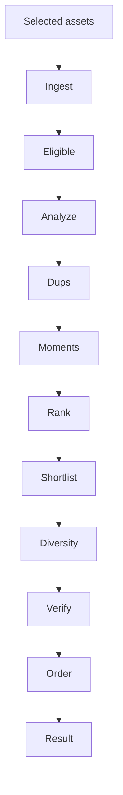

# 04 — Selection Engine Design (pipeline + mechanics owner)

**Responsibility:** This file owns how curation runs: stage order and mechanics for ingest → eligible → analyze → dups → moments → rank → shortlist → diversity → verify → order, candidate windows, greedy marginal-utility fill, the config struct, determinism mechanics, and failure degradation.

**Not owned here:** selection policy, formulas, sizing, and reason-code meanings ([03](03-photo-selection-rules.md)), stored representation ([06](06-data-model.md)), PhotoKit/Vision call shapes ([07](07-apple-framework-integration.md)), budgets, concurrency numbers, and timing targets ([08](08-performance-spec.md)), orchestration, scheduling, and app structure ([05](05-ios-architecture.md)), review UX and wording ([02](02-ux-flows.md)), privacy, retention, and redaction ([09](09-privacy-and-permissions.md)), QA procedure ([10](10-manual-qa-and-selection-evaluation.md)), metrics ([11](11-analytics-and-metrics.md)). Where those topics appear below, this file states the mechanic; the linked file states the rule.

Related docs:

- `03-photo-selection-rules.md` — what to pick and why
- `05-ios-architecture.md` — orchestration, scheduling, workers
- `06-data-model.md` — stored shapes
- `07-apple-framework-integration.md` — PhotoKit/Vision APIs
- `08-performance-spec.md` — budgets and targets

---

## 1. Pipeline diagram (read first)



```text
Selected assets
    ↓ ingest (metadata only, chrono sort)
Eligible assets
    ↓ analyze (downscaled images, one decode per asset)
Analyzed assets
    ↓ dups (windowed candidate pairs → clusters → one rep each)
Representatives
    ↓ moments (time-ordered segments)
Moments
    ↓ rank (local rank inside each moment)
Moment candidates
    ↓ shortlist (small pool for final pass)
Shortlist
    ↓ diversity (greedy fill with marginal utility)
Final picks
    ↓ verify + chrono order
Result
```

Each stage shrinks the working set for the next stage. Cheap work runs first; image decode and pairwise comparison run only on bounded neighborhoods.

## 2. Stages, inputs, outputs

| # | Stage | Input | Output | Mechanic |
|---|---|---|---|---|
| 1 | Ingest | Selected asset IDs | Chrono-ordered asset records | Metadata only, no pixels |
| 2 | Eligible | Ordered records | Eligible subset + skip list | Conservative filter; unsure stays in |
| 3 | Analyze | Eligible assets | Per-asset analysis facts | Downscaled image, decode once, release |
| 4 | Dups | Analyses + time order | Clusters + one representative each + alternatives | Windowed pairs, union-find, local winner |
| 5 | Moments | Representatives in time order | Moment list | Gap scan + visual/location adjust |
| 6 | Rank | Moments | Ranked candidates per moment | Local rank only, no global sort |
| 7 | Shortlist | Moment candidates | Shortlist pool | Cap pool size; carry alternatives |
| 8 | Diversity | Shortlist | Final picks | Protected first, then greedy fill |
| 9 | Verify | Final picks | Checked picks | Small subset re-check at most |
| 10 | Order | Checked picks | Chrono-ordered result | Rank decides inclusion; date decides order |

Engine input is a session (asset IDs + config); engine output is a result (picks + shortlist + alternatives + decisions). Stored field shapes: [06](06-data-model.md). What each score means and which photo should win: [03](03-photo-selection-rules.md).

Typical reduction for ~1,000 inputs (illustration, not a quota):

| Stage | Working set |
|---|---|
| Selected | ~1,000 |
| Eligible | ~950–1,000 |
| Representatives (post-dups) | ~600–800 |
| Moment candidates | ~200–350 |
| Shortlist | ~150–250 (about 2× final target) |
| Final | sized per [03](03-photo-selection-rules.md) |

## 3. Stage 1 — Ingest

Read cheap metadata for each selected asset (identifier, date, size, subtype, favorite flag, burst/location refs when present). Do not load pixels. Sort by capture date ascending; fall back to enumeration order when dates are missing. Missing GPS, favorite state, or burst info never blocks ingest — see failure handling in §12.

## 4. Stage 2 — Eligible

Drop only assets the pipeline cannot process (unsupported type, undecodable, unresolvable after retry, excluded class per [03](03-photo-selection-rules.md)). Keep imperfect-but-decodable images; quality judgment belongs to later stages, not here. Each skipped asset records a skip category so review UI can explain; code list: [03](03-photo-selection-rules.md), stored shape: [06](06-data-model.md).

## 5. Stage 3 — Analyze

Analyze on a downscaled image. Default: 512 px long edge. This default lives here; [07](07-apple-framework-integration.md) notes loader limits, [08](08-performance-spec.md) notes cost.

Mechanics:

```text
eligible asset → decode once at analysis size
  → run all analyses off that one decode
  → persist small facts → release image
```

One decode fans out to every signal (sharpness, exposure, faces, similarity features). Never hold hundreds of decoded images; never analyze degraded preview frames when a final frame is required. API call shapes: [07](07-apple-framework-integration.md). Stored analysis shape: [06](06-data-model.md). What counts as rejected vs penalized: [03](03-photo-selection-rules.md).

## 6. Stage 4 — Dups

### 6.1 Candidate windows

Do not compare every pair. Generate candidates only inside bounded neighborhoods:

| Window | Mechanic |
|---|---|
| Same burst identifier | Always compare |
| Time-adjacent (default window 90 s) | Compare each photo against nearby photos only |
| Outside window | Never compare directly |

The window value is config (`duplicateTimeWindow`, §10). Why this bound works: after chrono sort, duplicate comparison is near-linear in practice instead of quadratic. Complexity notes: §13.

### 6.2 Pairwise decision

For each candidate pair, compute an abstract similarity distance (a number; this doc does not define the Vision backend — see [07](07-apple-framework-integration.md)) and apply:

```text
if same burst → likely near-duplicate
else if time-close AND visual distance < threshold → near-duplicate
else → distinct
```

Thresholds live in config (`duplicateSimilarityThreshold`, §10). What "near-duplicate" means and when two survive: [03](03-photo-selection-rules.md).

### 6.3 Clustering

Convert pairwise hits into clusters with union-find (connected components). No clustering framework needed. Exact-duplicate sets and near-duplicate clusters are separate types; definitions: [03](03-photo-selection-rules.md), stored shape: [06](06-data-model.md).

### 6.4 Winner + alternatives

Pick one representative per cluster using the local comparison of analyses already computed (technical + face + composition facts). Because cluster members show nearly identical content, small technical differences decide here. Keep 1–2 close losers as alternatives for review swap; the rest leave the pipeline with a duplicate reason. Which signals outrank which: [03](03-photo-selection-rules.md).

## 7. Stage 5 — Moments

Scan representatives in time order and cut segments into moments.

Mechanic:

```text
sort by date → walk gaps in order
  gap < soft gap → same moment
  soft gap ≤ gap < hard gap → check visual/location continuity, then decide
  gap ≥ hard gap → new moment
```

Defaults live in config: `momentSoftGap` (~3 min), `momentHardGap` (~15 min). Time is the primary signal because it is cheap and always present; visual similarity adjusts borderline gaps; location adjusts only when present and never blocks grouping. Moment/duplicate definitions and per-moment keeper policy: [03](03-photo-selection-rules.md). Stored moment shape: [06](06-data-model.md).

## 8. Stage 6 — Rank (within moment)

Rank candidates locally inside each moment. No cross-moment comparison happens here. Output per moment is an ordered candidate list with a local rank. Scoring policy, weights, face/group/scene rules, and keeper counts: [03](03-photo-selection-rules.md). This stage only executes the order: score each candidate from its stored analysis, sort stably, truncate per the configured per-moment cap (`maxPhotosPerMoment`, §10).

## 9. Stage 7 — Shortlist

Collect moment candidates into one pool sized per [03 §17](03-photo-selection-rules.md) (~2× default, 1.5×–2.5× operating range; `shortlistMultiplier`, §10). Purpose: separate local ranking from global album assembly, keep alternatives available, and give the diversity pass a small input. Inclusion policy and sizing math: [03](03-photo-selection-rules.md).

## 10. Stage 8 — Diversity (greedy fill)

Build the final album from the shortlist in passes:

```text
protected picks (structural keeps per 03)
  → one core representative per remaining meaningful moment
  → greedy fill of leftover slots by marginal utility
  → stop when target reached or utility falls below floor
```

### Marginal-utility loop

```text
function marginalUtility(candidate, alreadySelected):
    utility = candidate.baseScore
    utility += coverage gains (moment / people / visual still uncovered)
    utility -= redundancy penalty (similarity to already-picked)
    utility -= moment saturation penalty (0 picked → high gain; 3–4 picked → ~none)
    return utility

loop:
    pick highest-utility candidate
    recalculate utility of the rest
```

Mechanics owned here: greedy order, recalculation after each pick, saturation curve (each extra pick from one moment/scene pays less), redundancy penalty scaled by max similarity to already-picked photos, duplicate-cluster invariant (one final pick per true near-duplicate cluster under normal conditions). Policy owned in [03](03-photo-selection-rules.md): which gains exist, their weights, diversity dimensions, coverage rules, sizing. Stored decision shape: [06](06-data-model.md).

End-to-end pseudocode:

```text
function curate(assets, config):
    ordered     = ingestMetadata(assets)
    eligible    = filterEligible(ordered)
    analyses    = analyzeThumbnails(eligible, config.analysisSize)
    clusters    = buildClusters(eligible, analyses, config.duplicateWindow)
    reps        = chooseRepresentatives(clusters)
    moments     = segmentMoments(reps, config.momentGaps)
    ranked      = rankWithinMoments(moments)
    shortlist   = buildShortlist(ranked, config.shortlistMultiplier)
    album       = protectedPicks(shortlist)
    album      += coreRepresentatives(shortlist, album)
    while album.count < target and bestUtility(shortlist, album) > floor:
        album.add(highestMarginalUtility(shortlist, album))
    album = verifyFinalAlbum(album)
    return orderChronologically(album)
```

## 11. Stages 9–10 — Verify + order

Verify pass checks: no double-picked cluster, no dropped protected pick, per-moment caps hold, count in range, assets still resolvable, order valid. Higher-resolution re-check is allowed for a small subset of close finalists only. Default output order is capture-date ascending; rank decides inclusion, date decides display. Editorial sequencing is out of scope. Review-surface behavior: [02](02-ux-flows.md).

## 12. Config struct

One struct holds every tuning knob. No threshold is scattered through stage code. Policy defaults and weight values: [03 §17](03-photo-selection-rules.md); this table defines the mechanic each key controls.

| Key | Controls |
|---|---|
| `analysisImageMaxDimension` | Downscale long edge (default 512) |
| `duplicateTimeWindow` | Pairwise candidate window (default ~90 s) |
| `duplicateSimilarityThreshold` | Pair distance cutoff for near-duplicate |
| `momentSoftGap` / `momentHardGap` | Moment cut gaps (defaults ~3 min / ~15 min) |
| `maxPhotosPerMoment` | Cap on keepers per moment |
| `targetSelectionRatio` / `minimumFinalCount` / `maximumFinalCount` | Final-size target inputs (policy in 03) |
| `shortlistMultiplier` | Shortlist pool as multiple of final target (~2×) |
| `technicalQualityWeight`, `humanImportanceWeight`, `representativenessWeight`, `uniquenessWeight` | Score mix (values in 03) |
| `redundancyPenaltyWeight` | Greedy-fill repetition cost |
| `lowQualityThreshold` / `hardRejectThreshold` | Penalty floor vs reject floor (tiers in 03) |

```swift
struct SelectionConfiguration {
    var analysisImageMaxDimension: Int
    var duplicateTimeWindow: TimeInterval
    var duplicateSimilarityThreshold: Double
    var momentSoftGap: TimeInterval
    var momentHardGap: TimeInterval
    var maxPhotosPerMoment: Int
    var targetSelectionRatio: Double
    var minimumFinalCount: Int
    var maximumFinalCount: Int
    var shortlistMultiplier: Double
    var technicalQualityWeight: Double
    var humanImportanceWeight: Double
    var representativenessWeight: Double
    var uniquenessWeight: Double
    var redundancyPenaltyWeight: Double
    var lowQualityThreshold: Double
    var hardRejectThreshold: Double
}
```

Stored config shape and versioning: [06](06-data-model.md). Tuning procedure: [10](10-manual-qa-and-selection-evaluation.md).

## 13. Complexity and layering

- Duplicate search runs on windowed candidates, not all pairs — near-linear in practice, not quadratic. Moment scan is linear after the initial chrono sort. Final assembly runs on the shortlist, not the full input. Time/memory budgets: [08](08-performance-spec.md).
- Keep analysis separate from decisions: the analysis layer answers "how sharp / how many faces / how similar"; the decision layer answers "who wins / how many per moment / does this add diversity". Cached analyses are reusable across re-ranks; session-specific ranks are not. Cache shape and versioning: [06](06-data-model.md).
- Keep components small and plain (`AssetAnalyzer`, `SimilarityClusterer`, `MomentSegmenter`, `MomentRanker`, `ShortlistBuilder`, `AlbumSelector`). No plugin framework, DSL, vector database, or remote inference for MVP.
- Scheduling, worker counts, batch edges, cancellation checkpoints, and resume mechanics: [05](05-ios-architecture.md) and [08](08-performance-spec.md). PhotoKit/Vision call mechanics: [07](07-apple-framework-integration.md). This doc only requires that every expensive stage exposes a cancel point and leaves no corrupt state behind.
- Debug trace per photo (asset → moment → cluster → local rank → decision + reasons) stays dev-only. Reason-code meanings: [03 §16](03-photo-selection-rules.md); stored shape: [06](06-data-model.md).

## 14. Failure degradation

One bad asset never fails a session. Degrade per asset, continue the batch, report analyzed vs unavailable counts at the end.

| Failure | Mechanic |
|---|---|
| Analysis fails for one photo | Keep the photo in the pipeline; rank from metadata + moment context; never auto-reject on analysis failure alone |
| Asset unresolvable / iCloud unfetchable | Mark unavailable, skip it, continue; report count |
| Missing GPS / favorite / burst | Proceed normally; group with available signals |
| Missing capture date | Fall back to enumeration order |
| Cancel requested | Stop starting new assets, finish the safe unit, release temps, keep completed analyses |

Retry and backoff rules: [08](08-performance-spec.md); PhotoKit error mapping: [07](07-apple-framework-integration.md); stored failure shape: [06](06-data-model.md).

## 15. Invariants

- The engine MUST be deterministic: same assets plus same analyses plus same configuration produce the same output. Order tie-breaks by the policy in [03 §15](03-photo-selection-rules.md); randomness is forbidden as a decider.
- Expensive work MUST run late: full-resolution loads happen only for small-subset verification, review display, or export — never for bulk analysis of the whole input.
- The engine MUST never destroy user content: no delete, modify, move, or permanent reject of originals. A rejected photo means not included in the recommended album only.
- Analysis failure alone MUST NOT cause rejection.
- A true near-duplicate cluster must normally contribute at most one final pick; two picks mean the cluster was misgrouped (policy in 03).
- Every final pick MUST carry at least one decision reason (meanings in [03](03-photo-selection-rules.md)).
- Final picks MUST be a subset of analyzed eligible assets, ordered chronologically by default.

## 16. Links and Uncertain

- Policy, formulas, sizing, reasons: [03](03-photo-selection-rules.md).
- Orchestration and scheduling: [05](05-ios-architecture.md).
- Stored shapes: [06](06-data-model.md).
- PhotoKit/Vision APIs: [07](07-apple-framework-integration.md).
- Budgets and targets: [08](08-performance-spec.md).
- Privacy and redaction: [09](09-privacy-and-permissions.md).
- QA and tuning: [10](10-manual-qa-and-selection-evaluation.md).

Uncertain (mechanics impact only; policy tuning lives in 03/10):

1. Best duplicate window width for dense events without drifting toward quadratic cost.
2. Soft/hard moment-gap edges across libraries with uneven shooting density.
3. Whether the verify pass needs any full-resolution re-check, or downscaled facts suffice.
4. Smallest stable tie-break key set beyond score + identifier order.
