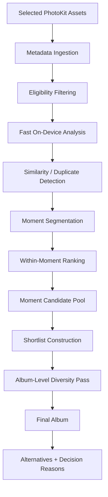

# Photos Curator — Selection Engine Design

**Document:** `04_Selection_Engine_[Design.md](http://Design.md)`  
**Status:** MVP Design Specification  
**Product:** Photos Curator  
**Related documents:**

- `01_[PRD.md](http://PRD.md)`
- `02_UX_[Flows.md](http://Flows.md)`
- `03_Photo_Selection_[Rules.md](http://Rules.md)`
- `05_iOS_[Architecture.md](http://Architecture.md)`
- `06_Data_[Model.md](http://Model.md)`
- `07_Apple_Framework_[Integration.md](http://Integration.md)`
- `08_Performance_[Spec.md](http://Spec.md)`
- `10_Manual_QA_and_Selection_[Evaluation.md](http://Evaluation.md)`

---

# 1. Purpose

This document defines how the Photos Curator selection engine transforms a large set of user photos into a compact, high-quality recommended album.

The primary target scenario is:

> Approximately 1,000 trip photos → analyzed on-device → organized into moments → redundant photos removed → shortlist generated → final curated album produced.

The engine should approximate the decisions a person would make when manually curating a trip album:

1. Remove obvious failures.
2. Collapse bursts and near-duplicates.
3. Understand which photos belong to the same moment.
4. Pick the strongest photo or photos from each meaningful moment.
5. Preserve important people and unique moments.
6. Prevent repetitive subjects from dominating the album.
7. Produce an album that represents the entire trip rather than merely ranking the most aesthetically attractive individual images.

The engine is not intended to identify the objectively "best" photos.

Its purpose is to produce a **coherent and representative album with minimal manual effort**.

---

# 2. Design Principles

The selection engine follows several core principles.

## 2.1 Coverage before pure aesthetics

A photo should not be selected only because it has a high technical or aesthetic score.

A slightly weaker photo may be more valuable when it represents:

- a unique moment,
- a person otherwise absent from the album,
- a different location,
- an important group photo,
- a transition in the trip,
- or an otherwise missing part of the story.

Therefore:

> Album-level diversity and coverage take priority over globally ranking photos by quality.

---

## 2.2 Compare photos locally before comparing them globally

Most meaningful decisions are relative.

For example:

- Which frame is best within a burst?
- Which portrait is best from the same pose?
- Which group photo is strongest from the same moment?
- Which landscape best represents a particular viewpoint?

The engine should therefore first compare visually and temporally related photos.

A global score across all 1,000 photos is insufficient.

---

## 2.3 Reduce the problem progressively

The engine should not run expensive analysis against every possible pair of photos.

Instead, selection happens through progressive reduction:

```text
Original assets
    ↓
Eligible assets
    ↓
Analyzed assets
    ↓
Near-duplicate clusters
    ↓
Moments
    ↓
Moment-level candidates
    ↓
Shortlist
    ↓
Album-level diversity pass
    ↓
Final album

```

Each stage reduces the search space for the following stage.

---

## 2.4 Prefer understandable heuristics over opaque models

The MVP should not require:

- custom model training,
- cloud AI,
- large multimodal models,
- vector databases,
- server-side inference,
- complicated optimization solvers,
- or personalization models.

Use Apple-provided on-device analysis plus deterministic heuristics.

The engine should remain explainable enough that a selection can be associated with reasons such as:

```text
best_in_duplicate_cluster
best_group_photo
unique_moment
strong_face_quality
best_landscape
diversity_pick
only_photo_of_person

```

---

## 2.5 Expensive processing should happen late

The engine should initially operate on approximately **512 px analysis images** or equivalent efficient representations.

Higher-resolution asset loading should only occur when necessary for:

- resolving close rankings,
- verifying finalists,
- exporting,
- or displaying higher-resolution review content.

Do not load original-resolution versions of 1,000 photos into memory.

---

## 2.6 Never silently destroy user content

The selection engine produces recommendations.

It does not:

- delete photos,
- modify originals,
- permanently reject assets,
- move originals,
- or automatically clean the user's library.

A rejected photo simply means:

> Not included in the recommended album.

The original remains untouched.

---

# 3. Scope

The MVP selection engine is responsible for:

- ingesting selected PhotoKit assets,
- reading relevant metadata,
- generating analysis thumbnails,
- detecting unusable or low-quality frames,
- detecting duplicate and near-duplicate photos,
- grouping photos into moments,
- computing photo-level quality signals,
- identifying human-oriented photos,
- identifying group photos,
- ranking candidates within moments,
- generating a shortlist,
- generating the final album,
- enforcing album-level diversity,
- preserving important unique photos,
- generating alternative candidates,
- generating machine-readable selection reasons,
- supporting cancellation and resumable processing.

---

# 4. Explicit Non-Goals

The MVP does not attempt to perform:

- professional photography critique,
- generative photo editing,
- photo enhancement,
- automatic deletion,
- cloud photo processing,
- face identity recognition across users,
- social relationship inference,
- automatic emotional importance prediction,
- text understanding from captions,
- semantic trip storytelling using an LLM,
- cinematic album sequencing,
- custom ML model training,
- personalized ranking learned from long-term behavior.

These capabilities may be explored after the core selection engine proves useful.

---

# 5. Selection Hierarchy

The conceptual hierarchy is:

```text
Selection Session
└── Event
    └── Moment
        └── Similarity Cluster
            └── Photo

```

For a typical trip:

```text
Trip
├── Day / Event
│   ├── Moment
│   │   ├── near-duplicate
│   │   ├── near-duplicate
│   │   └── alternative
│   └── Moment
└── Day / Event

```

The most important unit for MVP selection is the **Moment**.

Events provide coarse coverage.

Similarity clusters remove redundancy.

Photos are ranked primarily against other photos from the same moment.

---

# 6. Pipeline Overview



For approximately 1,000 source photos, a typical reduction may look like:

```text
1,000 source photos
    ↓
950–1,000 eligible photos
    ↓
600–800 meaningful similarity representatives
    ↓
150–250 shortlist candidates
    ↓
~60–120 recommended final photos

```

These numbers are guidelines rather than hard requirements.

The number of final photos should adapt to the actual number and diversity of moments in the source material.

---

# 7. Engine Input

The engine receives a `SelectionSession`.

Conceptually:

```swift
SelectionSessionInput {
    assets: [PhotoAsset]
    configuration: SelectionConfiguration
}

```

Required asset information includes:

```text
asset identifier
capture timestamp
media type
dimensions
orientation
favorite status if available
burst metadata if available
location if available

```

The engine should not require GPS information.

Location is supplemental.

Timestamp ordering is the primary structural signal.

---

# 8. Engine Output

The engine returns:

```text
SelectionResult
├── finalSelections
├── shortlist
├── alternatives
├── rejectedCandidates
├── moments
├── statistics
└── decision metadata

```

Every analyzed photo should have an internal disposition.

Example:

```text
selected
shortlisted
alternative
rejected_duplicate
rejected_low_quality
rejected_redundant
analysis_failed
unsupported

```

The UI does not necessarily expose all internal states.

---

# 9. Stage 1 — Asset Ingestion

The first stage converts selected PhotoKit assets into lightweight internal records.

Do not load image pixels yet unless required.

For each asset, collect metadata such as:

```text
local identifier
capture date
pixel dimensions
media subtype
favorite state
burst identifier
location

```

Assets should immediately be ordered chronologically.

Primary ordering:

```text
creationDate ascending

```

Fallback ordering may use PhotoKit enumeration order when timestamps are unavailable.

---

# 10. Stage 2 — Eligibility Filtering

Eligibility filtering removes assets that the engine cannot or should not process.

Potential exclusions include:

- videos when the current selection mode supports photos only,
- corrupted assets,
- inaccessible assets,
- unsupported media,
- assets that cannot be retrieved after reasonable retry,
- assets intentionally excluded by product rules.

Eligibility filtering must be conservative.

If an image can be analyzed imperfectly, it is generally preferable to retain it rather than reject it.

---

# 11. Stage 3 — Fast Image Analysis

Eligible images are analyzed using efficient downscaled representations.

Recommended analysis resolution:

```text
maximum dimension ≈ 512 px

```

The exact size may be adjusted based on performance measurements.

For each image, derive a lightweight `PhotoAnalysis`.

Conceptually:

```text
PhotoAnalysis {
    technicalQuality
    visualFeatures
    faceInformation
    visualSimilarityRepresentation
    confidence
}

```

---

# 12. Technical Quality Signals

The MVP should use a small number of interpretable signals.

Potential signals include:

### Sharpness

Estimate whether the image is:

- clearly sharp,
- mildly soft,
- severely blurred.

Sharpness should be especially important when comparing nearly identical frames.

---

### Exposure

Detect obviously problematic:

- underexposure,
- overexposure,
- blown highlights,
- heavily clipped shadows.

Exposure should generally be used as a penalty rather than a strict rejection rule.

---

### Face Quality

For photos containing people, consider:

- number of detected faces,
- face size,
- face sharpness,
- whether major faces are partially outside the frame,
- whether important faces are extremely small,
- severe face occlusion when detectable.

Avoid assuming that more faces always means a better image.

---

### Image usability

Detect extreme failures such as:

```text
almost entirely black
almost entirely white
severe blur
invalid image data

```

Only extremely poor images should be hard-rejected.

Mild imperfections should affect ranking instead.

---

# 13. Quality Score

A normalized technical quality score may be represented as:

```text
technicalQuality ∈ [0, 1]

```

For example:

```text
technicalQuality =
    0.40 × sharpness
  + 0.25 × exposure
  + 0.20 × subjectQuality
  + 0.15 × framingQuality

```

These values are initial tuning parameters, not permanent product rules.

They must live in centralized configuration rather than being scattered throughout the codebase.

---

# 14. Hard Reject vs Soft Penalty

The engine must distinguish between:

### Hard rejection

Used only when the image is clearly unusable.

Examples:

```text
corrupt
almost completely black
extreme motion blur
failed asset retrieval

```

### Soft penalty

Used when an image is imperfect but potentially meaningful.

Examples:

```text
slightly blurred
slightly dark
awkward framing
small face
minor exposure issue

```

This distinction prevents meaningful unique moments from disappearing because of technical imperfections.

---

# 15. Stage 4 — Duplicate and Near-Duplicate Detection

Duplicate removal is one of the highest-value stages of the engine.

Trip photo libraries commonly contain sequences such as:

```text
IMG_101
IMG_102
IMG_103
IMG_104
IMG_105

```

where the subject barely changes.

The engine should identify these photos before album-level ranking.

---

# 16. Duplicate Categories

Internally, distinguish between three concepts.

## 16.1 Exact or effectively identical

Photos are visually indistinguishable for album purposes.

Examples:

- accidental duplicate saves,
- exported copies,
- repeated identical frames.

Only one should normally survive.

---

## 16.2 Near-duplicate

Photos depict essentially the same:

- moment,
- framing,
- people,
- pose,
- viewpoint.

Example:

```text
five photos taken within three seconds of the same group pose

```

The engine should usually select one winner.

---

## 16.3 Similar but distinct

Photos depict related content but provide meaningfully different information.

Examples:

```text
wide shot of a temple
close-up architectural detail
portrait in front of the temple

```

These must not be collapsed into a duplicate cluster.

---

# 17. Duplicate Candidate Generation

Do not compare every photo against all other photos.

For 1,000 photos:

```text
1,000 × 999 / 2
≈ 500,000 comparisons

```

This is unnecessary.

Candidate comparisons should first be restricted by temporal proximity.

Example strategy:

```text
for each photo:
    compare against nearby photos within a limited time window

```

Potential candidate windows:

```text
same burst identifier
OR
capture difference <= 90 seconds

```

The exact threshold should be configurable.

---

# 18. Similarity Decision

Candidate pairs are evaluated using visual similarity.

Conceptually:

```text
if sameBurst:
    likelyNearDuplicate

else if timeDistance small
    AND visualDistance < duplicateThreshold:
        nearDuplicate

else:
    distinct

```

A similarity representation such as an Apple Vision feature print may be used by the implementation layer.

The selection engine should depend only on an abstract similarity distance.

---

# 19. Duplicate Clustering

Pairwise near-duplicate relationships are converted into clusters.

Example:

```text
Cluster A
├── IMG_101
├── IMG_102
├── IMG_103
└── IMG_104

```

A simple connected-components or union-find implementation is sufficient.

No sophisticated clustering framework is required.

---

# 20. Selecting the Best Duplicate

Within each near-duplicate cluster, choose a primary representative.

For ordinary photos:

```text
duplicateWinnerScore =
    technicalQuality
  + faceQualityBonus
  + compositionBonus
  - severePenalty

```

Because all photos already represent nearly identical content, technical differences become much more important here than at album level.

Typical winner characteristics:

- sharper,
- better exposed,
- fewer major face problems,
- stronger framing.

---

# 21. Duplicate Alternatives

The engine should retain one or more alternatives when scores are close.

Example:

```text
Winner: IMG_103

Alternatives:
IMG_102
IMG_104

```

This supports review UI such as:

> "We selected this photo from 4 similar photos."

The alternatives remain available without cluttering the main shortlist.

---

# 22. Stage 5 — Moment Segmentation

After redundancy reduction, remaining photos are grouped into **moments**.

A moment represents a coherent photographic situation.

Examples:

```text
airport departure
breakfast
walking through a market
group photo at a temple
sunset viewpoint
restaurant dinner
hotel balcony

```

Moment segmentation is essential because it gives the engine a local context for selection.

---

# 23. Moment Segmentation Signals

The MVP should primarily use:

1. capture time,
2. visual continuity,
3. optional location continuity.

Time should remain the dominant signal because it is:

- cheap,
- available on almost all photos,
- easy to reason about,
- reliable enough for an MVP.

---

# 24. Time-Based Segmentation

Start with a chronological stream.

Example:

```text
10:01:02
10:01:05
10:01:08
10:02:31

10:19:42
10:20:13

```

The large gap around 17 minutes strongly suggests a new moment.

A configurable segmentation rule may use:

```text
soft gap threshold ≈ 3 minutes
hard gap threshold ≈ 15 minutes

```

Interpretation:

```text
gap < softThreshold
→ usually same moment

softThreshold <= gap < hardThreshold
→ evaluate visual continuity

gap >= hardThreshold
→ normally start a new moment

```

These are starting values and should be tuned using real libraries.

---

# 25. Visual Continuity

Time alone is insufficient.

For example:

```text
12:00 landscape
12:00 portrait
12:01 landscape

```

These probably belong to the same moment even when visually different.

Conversely:

```text
12:00 hotel room
12:02 street outside

```

may represent separate moments.

Visual similarity therefore modifies, but does not replace, time-based segmentation.

---

# 26. Location Continuity

GPS coordinates may improve segmentation when available.

Examples:

```text
photos separated by 10 minutes
but captured several kilometers apart
→ likely different moment

```

Location data must remain optional.

The engine must work correctly when no photo contains GPS metadata.

---

# 27. Moment Model

Conceptually:

```text
Moment {
    id
    startTime
    endTime
    assets
    similarityClusters
    candidatePhotos
    importance
}

```

The canonical data structure is defined in `06_Data_[Model.md](http://Model.md)`.

---

# 28. Stage 6 — Within-Moment Ranking

After grouping photos by moment, the engine ranks candidates locally.

This is where the primary photo-selection decision occurs.

For each moment:

```text
Moment
├── candidate 1
├── candidate 2
├── candidate 3
└── candidate 4

```

The engine decides whether the moment deserves:

```text
0
1
2
3
or occasionally 4

```

final candidates.

---

# 29. Moment-Level Selection Rule

As a general MVP rule:

> Select between 1 and 4 candidate photos from a meaningful moment.

A typical moment should contribute:

```text
1–2 photos

```

Three or four should require clear visual differences.

Examples:

### One photo

```text
single portrait pose
one landscape viewpoint
simple meal photo

```

### Two photos

```text
group portrait + candid
wide landscape + detail
portrait + environmental shot

```

### Three or four photos

Reserved for moments containing clearly distinct visual information.

---

# 30. Human-Oriented Photos

Photos containing people should not compete using exactly the same rules as pure landscapes.

For human-oriented photos, important signals include:

```text
face presence
number of faces
face prominence
face quality
technical quality
duplicate uniqueness

```

A portrait with a slightly weaker composition may still outrank a technically superior empty scene when human representation would otherwise be lost.

---

# 31. Group Photos

Group photos deserve special treatment because they often represent socially important moments.

The engine should detect group-photo candidates based primarily on:

```text
multiple significant faces
similar face scale
people occupying a substantial portion of the image

```

When several near-identical group photos exist, prioritize:

```text
sharpness around faces
overall face quality
exposure
framing

```

Do not automatically select every group photo.

Multiple frames of the same group pose should normally collapse to one.

---

# 32. Landscape Photos

Landscape photos should not receive a penalty simply because they contain no faces.

For non-human scenes, ranking should emphasize:

```text
sharpness
exposure
visual quality
representativeness
uniqueness

```

The engine should also prevent a trip containing many landscapes from producing twenty visually similar views of the same mountain, beach, or skyline.

Redundancy should still be evaluated at moment and album level.

---

# 33. Unique-Moment Protection

A unique moment must receive special protection from pure quality ranking.

Example:

```text
Moment A:
10 technically excellent beach photos

Moment B:
1 slightly blurred photo of an important dinner

Moment C:
1 acceptable airport departure photo

```

A global ranking could remove B and C.

Photos Curator should not.

Therefore, the engine should maintain a concept such as:

```text
uniqueMomentBonus

```

or preferably a structural selection rule:

> A viable unique moment should be represented unless album-size constraints strongly require compression.

This is more reliable than simply giving the photo a slightly higher numerical score.

---

# 34. Only-Person Protection

If a detected person or visually distinct human subject only appears in a small portion of the source album, associated moments should receive additional preservation priority.

The MVP does **not** need to identify who the person is.

The system only needs enough visual continuity to avoid removing people who otherwise disappear from the final album.

If reliable cross-photo person clustering is unavailable in MVP, this rule may initially operate conservatively at the moment level.

---

# 35. Moment Representative Score

A moment candidate may use a normalized score such as:

```text
candidateScore =
    0.35 × technicalQuality
  + 0.30 × humanImportance
  + 0.20 × momentRepresentativeness
  + 0.15 × uniqueness
  - penalties

```

This is an initial engineering default.

It is not intended as a scientifically optimized formula.

The weights must be configurable and tuned through manual selection evaluation.

---

# 36. Why Diversity Is Not Just Another Score

Diversity should not be reduced to:

```text
finalScore += 0.1 × diversity

```

Album-level diversity represents a structural constraint.

For example, after selecting:

```text
10 beach sunsets

```

the marginal value of selecting the 11th similar sunset should be extremely small, even if its individual quality score is high.

Therefore diversity is applied during final album construction as a **marginal utility and coverage problem**.

---

# 37. Stage 7 — Candidate Pool

After ranking individual moments, create a moment-level candidate pool.

Example:

```text
Moment 01 → 2 candidates
Moment 02 → 1 candidate
Moment 03 → 3 candidates
Moment 04 → 1 candidate
...

```

This pool is much smaller than the original photo library.

For a 1,000-photo input, the candidate pool might contain roughly:

```text
200–350 photos

```

before the shortlist is constructed.

---

# 38. Stage 8 — Shortlist Construction

The shortlist contains photos that are plausible final selections.

Its purposes are:

1. dramatically reduce the remaining search space,
2. retain alternatives for review,
3. separate local ranking from final album optimization.

For approximately 1,000 source photos, an initial target is:

```text
150–250 shortlist photos

```

The shortlist should generally be approximately:

```text
1.5×–2.5×

```

the intended final album size.

---

# 39. Shortlist Inclusion

Photos may enter the shortlist because they are:

```text
best photo in a moment
strong alternative
best group photo
best landscape
unique moment representative
person-coverage candidate
diversity candidate

```

A photo excluded from the shortlist should normally have a clear reason such as:

```text
near duplicate
weaker version of same moment
technically unusable
redundant scene

```

---

# 40. Target Final Album Size

The final album size should be adaptive rather than fixed.

A practical initial heuristic is:

```text
baseTarget = round(eligiblePhotoCount × 0.10)

```

with reasonable bounds.

For example:

```text
targetFinalCount =
    clamp(
        baseTarget,
        minimum: 30–40,
        maximum: 120–150
    )

```

For 1,000 eligible photos:

```text
target ≈ 100 photos

```

However, moment structure can override the raw percentage.

A source library with many genuinely distinct moments may require more photos.

A highly repetitive library may require fewer.

Therefore:

> Final album size is a target, not an absolute quota.

---

# 41. Stage 9 — Final Album Construction

Final album construction operates on the shortlist.

The algorithm should be simple and deterministic.

A greedy marginal-utility approach is sufficient.

There is no need for:

- integer programming,
- graph optimization,
- reinforcement learning,
- global ML ranking models.

---

# 42. Pass 1 — Forced Coverage

First reserve candidates required by structural rules.

Examples:

```text
critical unique moments
important group moments
otherwise-unrepresented sections of the trip
high-confidence unique human coverage

```

This prevents later global ranking from accidentally removing them.

---

# 43. Pass 2 — Core Moment Representatives

Add the highest-ranked representative of remaining meaningful moments.

The goal is broad trip coverage.

At this stage the album should already resemble a compressed chronological summary.

---

# 44. Pass 3 — Additional Moment Photos

Moments may receive additional photos when they provide sufficiently different visual information.

For example:

```text
Moment: Eiffel Tower viewpoint

Selected:
1. wide establishing shot
2. portrait
3. architectural detail

```

Do not add another photo if it provides almost the same information.

---

# 45. Pass 4 — Diversity-Aware Fill

Remaining album slots are filled using marginal utility.

Conceptually:

```text
utility(candidate) =
    intrinsicCandidateScore
  + coverageGain
  + peopleGain
  + momentGain
  + visualDiversityGain
  - redundancyPenalty

```

After each selection:

```text
recalculate marginal value of remaining candidates

```

This naturally lowers the priority of repetitive photos.

---

# 46. Redundancy Penalty

A candidate receives a redundancy penalty when the current album already contains photos that are:

```text
visually similar
from the same moment
from the same similarity cluster
representing the same subject

```

Conceptually:

```text
redundancyPenalty =
    maxSimilarityToAlreadySelectedPhotos × redundancyWeight

```

The exact implementation should remain lightweight.

---

# 47. Moment Saturation

Each moment has a saturation state.

Example:

```text
0 selected → very high coverage gain
1 selected → moderate additional gain
2 selected → low additional gain
3 selected → very low additional gain
4 selected → normally no further selection

```

This is one of the simplest mechanisms for avoiding repetitive albums.

---

# 48. Event-Level Coverage

When useful, moments may be grouped into coarse events.

Examples:

```text
morning
museum visit
lunch
afternoon walk
sunset
dinner

```

The MVP does not need sophisticated event understanding.

Events can initially be inferred using simple chronological gaps.

Event-level coverage prevents one unusually photo-heavy activity from dominating the entire album.

---

# 49. Chronological Balance

The album should approximately represent the chronological distribution of meaningful moments.

For example, a three-day trip should not accidentally produce:

```text
Day 1: 5 photos
Day 2: 82 photos
Day 3: 4 photos

```

unless the source material genuinely justifies such imbalance.

Chronological balance is a soft constraint.

It should not force equal numbers per day.

---

# 50. People Diversity

Repeated portraits of the same visible subjects should gradually lose marginal utility.

However, the engine should not attempt to infer:

```text
relationship
importance
family status
friendship

```

People coverage is visual, not social.

---

# 51. Landscape Diversity

Similarly, repeated views from essentially the same location should gradually lose utility.

Example:

```text
sunset #1
sunset #2
sunset #3
...
sunset #15

```

A few strong frames may survive.

The album should not include all fifteen solely because they individually score well.

---

# 52. Duplicate Invariant

A true near-duplicate cluster should normally contribute at most:

```text
1 final selection

```

If two photos deserve final selection, they probably should not have been placed in the same near-duplicate cluster.

This invariant is useful for debugging clustering thresholds.

---

# 53. Stage 10 — Final Verification

Before committing the recommended album, run a lightweight verification pass.

Verify:

```text
no accidental duplicate selections
no missing protected moment
moment limits respected
final count within reasonable range
final assets still accessible
selection ordering valid

```

Optionally, higher-resolution validation may be performed for close-ranking finalists.

This should only happen for a small subset of assets.

---

# 54. Final Album Ordering

The default album order should be chronological.

```text
creationDate ascending

```

The ranking score determines whether a photo is selected.

It should not normally determine album display order.

This keeps the final output intuitive and consistent with the chronology of the trip.

Future versions may introduce editorial sequencing.

That is not necessary for MVP.

---

# 55. Alternatives

For each final selection, the engine may retain close alternatives.

Example:

```text
Selected:
IMG_1098

Alternatives:
IMG_1096
IMG_1097

```

Alternatives are particularly useful for:

```text
portraits
group photos
near-duplicate bursts
similar landscapes

```

The review UI can allow the user to replace a recommendation without manually searching the original library.

---

# 56. Decision Reasons

Each significant selection decision should record machine-readable reason codes.

Recommended initial reasons:

```text
best_in_duplicate_cluster
best_in_moment
unique_moment
group_photo
human_coverage
landscape_representative
diversity_pick
technical_quality
favorite_bonus

```

Rejection reasons:

```text
duplicate
near_duplicate
weaker_same_moment
low_quality
redundant
unavailable
unsupported
analysis_failed

```

These reasons serve three purposes:

1. debugging,
2. analytics,
3. user-facing explanations where useful.

---

# 57. User Favorites

If PhotoKit exposes that the user previously marked an image as Favorite, this is a strong preference signal.

A Favorite should receive a meaningful selection bonus.

However, it should not automatically bypass all rules.

For example:

```text
five nearly identical favorites

```

should not necessarily produce five final photos.

A Favorite may instead:

- strongly influence which duplicate wins,
- increase moment importance,
- make exclusion less likely.

---

# 58. Failure Handling

The engine should degrade gracefully.

---

## 58.1 Analysis failure

If visual analysis fails for a photo:

```text
do not automatically treat it as bad

```

Use available metadata and moment context.

If the image represents a potentially unique moment, preserve it conservatively.

---

## 58.2 iCloud asset unavailable

If an asset requires download and cannot currently be retrieved:

```text
state = unavailable

```

The engine should:

- continue processing other assets,
- report unavailable assets,
- avoid failing the entire session.

Detailed PhotoKit behavior belongs in `07_Apple_Framework_[Integration.md](http://Integration.md)`.

---

## 58.3 Missing metadata

Missing:

```text
GPS
favorite state
burst information

```

must not prevent selection.

Missing capture date is more significant but should still have a fallback.

---

# 59. Determinism

Given:

```text
same assets
same analysis results
same configuration

```

the engine should produce the same result.

Avoid random ranking.

For equal scores, deterministic tie breaking may use:

```text
capture timestamp
asset identifier

```

Determinism is extremely useful during manual QA.

---

# 60. Configuration

All important thresholds should live in one configuration structure.

Conceptually:

```swift
SelectionConfiguration {
    analysisImageMaxDimension

    duplicateTimeWindow
    duplicateSimilarityThreshold

    momentSoftGap
    momentHardGap

    maxPhotosPerMoment

    minimumFinalCount
    maximumFinalCount
    targetSelectionRatio

    shortlistMultiplier

    technicalQualityWeight
    humanImportanceWeight
    representativenessWeight
    uniquenessWeight

    redundancyPenaltyWeight

    lowQualityThreshold
    hardRejectThreshold
}

```

Do not scatter numbers such as:

```swift
0.72
0.85
180
300

```

through multiple services.

Centralized configuration makes manual tuning practical.

---

# 61. Recommended Initial Configuration

Initial values may approximately start with:

```text
analysis image max dimension:
512 px

duplicate candidate time window:
90 seconds

moment soft gap:
3 minutes

moment hard gap:
15 minutes

maximum photos per ordinary moment:
4

target final ratio:
~10%

minimum final target:
30–40

maximum final target:
120–150

shortlist size:
~2× final target

```

These values are starting points.

They must be validated against real-world photo libraries using the process in:

`10_Manual_QA_and_Selection_[Evaluation.md](http://Evaluation.md)`

---

# 62. End-to-End Algorithm

High-level pseudocode:

```text
function curate(assets):

    assets = ingestMetadata(assets)

    eligible = filterEligibleAssets(assets)

    analyses = analyzeThumbnails(eligible)

    duplicateClusters =
        buildSimilarityClusters(
            eligible,
            analyses
        )

    representatives =
        chooseDuplicateRepresentatives(
            duplicateClusters
        )

    moments =
        segmentIntoMoments(
            representatives
        )

    for moment in moments:
        moment.candidates =
            rankCandidatesWithinMoment(moment)

    candidatePool =
        collectMomentCandidates(moments)

    shortlist =
        buildShortlist(candidatePool)

    protected =
        selectProtectedCandidates(shortlist)

    finalAlbum =
        protected

    finalAlbum +=
        selectCoreMomentRepresentatives(
            shortlist,
            finalAlbum
        )

    while finalAlbum.count < target:

        candidate =
            candidateWithHighestMarginalUtility(
                shortlist,
                finalAlbum
            )

        if candidate provides insufficient utility:
            break

        finalAlbum.add(candidate)

    finalAlbum =
        verifyFinalAlbum(finalAlbum)

    finalAlbum =
        sortChronologically(finalAlbum)

    return SelectionResult(
        finalAlbum,
        shortlist,
        alternatives,
        decisions
    )

```

---

# 63. Marginal Utility Algorithm

The final fill phase may conceptually use:

```text
function marginalUtility(candidate, selected):

    utility = candidate.baseScore

    if candidate covers unrepresented moment:
        utility += momentCoverageBonus

    if candidate improves people coverage:
        utility += peopleCoverageBonus

    if candidate improves visual diversity:
        utility += diversityBonus

    utility -= similarityToSelectedPenalty

    utility -= momentSaturationPenalty

    return utility

```

This algorithm should stay deliberately simple.

Its behavior can be understood and tuned without introducing a complex optimizer.

---

# 64. Example — 1,000 Photo Trip

Consider:

```text
Input:
1,000 photos

```

After eligibility:

```text
985 usable assets

```

Duplicate processing identifies:

```text
180 near-duplicate clusters

```

and removes hundreds of redundant frames from direct competition.

Moment segmentation produces:

```text
~120 meaningful moments

```

Local ranking reduces the pool to:

```text
~280 moment candidates

```

Shortlist construction produces:

```text
~190 photos

```

Final album construction selects:

```text
~95 photos

```

Possible result:

```text
985 analyzed

190 shortlist

95 recommended

including:

22 human-focused photos
8 group photos
28 landscapes
12 food/detail photos
25 other contextual/travel photos

```

The specific category distribution is not a required quota.

It illustrates the expected reduction process.

---

# 65. Example — Burst Selection

Input:

```text
12 group photos captured within 8 seconds

```

The engine detects:

```text
1 similarity cluster

```

Quality scores:

```text
IMG_001 → 0.73
IMG_002 → 0.77
IMG_003 → 0.79
IMG_004 → 0.91
IMG_005 → 0.86
...

```

Result:

```text
IMG_004 → selected representative

IMG_005 → alternative
IMG_003 → alternative

remaining images → duplicate/redundant

```

Only the representative enters normal moment ranking.

---

# 66. Example — Coverage vs Quality

Input:

```text
Moment A:
30 high-quality sunset photos

Moment B:
3 acceptable dinner photos

Moment C:
1 airport departure photo

```

Pure global ranking might produce:

```text
20 sunset photos
0 dinner
0 airport

```

Photos Curator should instead produce something closer to:

```text
Moment A:
2–4 sunset photos

Moment B:
1–2 dinner photos

Moment C:
1 airport photo

```

The exact number depends on total album size and photo quality.

The important property is that unique moments are represented.

---

# 67. Example — Landscape + Portrait

Moment:

```text
IMG_A — landscape
IMG_B — landscape, similar framing
IMG_C — portrait at same location
IMG_D — architectural detail

```

Expected:

```text
IMG_A or IMG_B
+
IMG_C
+
possibly IMG_D

```

The engine should not collapse all four into one cluster simply because they share the same location and capture time.

---

# 68. Cancellation

Selection may involve hundreds or thousands of assets.

Every expensive processing stage should support cancellation.

Cancellation checkpoints should exist between:

```text
asset batches
analysis stages
clustering
moment generation
shortlist generation
final optimization

```

Cancellation should not leave corrupted persistent state.

Detailed concurrency behavior belongs in `05_iOS_[Architecture.md](http://Architecture.md)` and `08_Performance_[Spec.md](http://Spec.md)`.

---

# 69. Resumability

Analysis results should be reusable when possible.

For example:

```text
Photo A already analyzed
→ do not recompute visual analysis unnecessarily

```

Caching should be asset-based.

The engine should distinguish between:

```text
asset analysis

and

session-specific decisions

```

Analysis can often be reused.

Selection decisions may change depending on the other photos in a session.

---

# 70. Cache Boundary

Good candidates for caching:

```text
thumbnail-derived analysis
visual similarity representation
face metadata
technical quality

```

Do not permanently cache session-specific values such as:

```text
moment membership
album diversity score
final rank

```

unless explicitly tied to a particular session.

---

# 71. Pipeline State Model

A session may conceptually transition through:

```text
created

loadingAssets

analyzing

clustering

segmentingMoments

buildingShortlist

selectingFinalAlbum

completed

```

Failure states:

```text
cancelled
partiallyCompleted
failed

```

The exact UI-facing representation is defined in `02_UX_[Flows.md](http://Flows.md)`.

---

# 72. Separation of Analysis and Decision Logic

The engine should clearly separate two responsibilities.

## Analysis layer

Answers questions such as:

```text
How sharp is this image?
How many faces are detected?
How similar are these two photos?

```

## Selection layer

Answers questions such as:

```text
Which photo should win this duplicate cluster?
How many photos should this moment contribute?
Does this candidate improve album diversity?

```

This separation is important.

It allows analysis implementations to improve without rewriting the entire selection algorithm.

---

# 73. Suggested Logical Components

The selection engine may be divided into lightweight components:

```text
SelectionEngine

AssetAnalyzer
SimilarityClusterer
MomentSegmenter
MomentRanker
ShortlistBuilder
AlbumSelector
SelectionExplainer

```

These are logical responsibilities.

They do not necessarily require separate Swift packages or elaborate dependency injection.

Keep the concrete architecture simple for MVP.

---

# 74. Avoid Premature Abstractions

Do not introduce architecture such as:

```text
RuleGraph
SelectionDSL
PluginEngine
GenericMLPipeline
RemoteInferenceProvider
MultipleRankingBackends
FeatureStore
VectorDatabase

```

unless a real product requirement appears.

The initial selection engine should remain understandable by reading a relatively small number of Swift files.

---

# 75. Performance Characteristics

For `N` photos, avoid global `O(N²)` similarity comparison.

Instead:

```text
chronological candidate generation
+
small temporal windows

```

should make duplicate comparison much closer to:

```text
O(N × K)

```

where `K` is the number of nearby candidate photos.

Moment processing is approximately linear after chronological sorting.

Album selection operates on a shortlist substantially smaller than the original input.

Detailed memory and throughput targets belong in:

`08_Performance_[Spec.md](http://Spec.md)`

---

# 76. Privacy Boundary

All image understanding and selection should occur on-device for the MVP.

The selection engine should not require:

```text
photo upload
remote embeddings
remote face analysis
cloud model inference

```

No face-analysis representation should leave the device.

Further requirements are defined in:

`09_Privacy_and_[Permissions.md](http://Permissions.md)`.

---

# 77. Explainability

For debugging, every final photo should be traceable through the pipeline.

Example:

```text
IMG_5032

Moment:
MOMENT_42

Similarity cluster:
CLUSTER_133

Local rank:
1 / 5

Selected because:
best_in_moment
group_photo
high_face_quality

Album contribution:
people_coverage
moment_coverage

```

Likewise, rejected photos should have a reason.

Example:

```text
IMG_5031

Rejected because:
near_duplicate

Preferred asset:
IMG_5032

```

This traceability will make manual tuning significantly easier.

---

# 78. Debug Mode

During development, the engine should support an internal debug representation.

For each photo:

```text
asset ID
moment ID
cluster ID
quality score
face count
local rank
decision
decision reasons

```

This does not need to be a user-facing feature.

A basic debug screen or console export is sufficient.

Do not build an elaborate internal analytics system for MVP.

---

# 79. Manual Evaluation Hooks

Because the project intentionally does not require automated test targets or test files, engine quality should be validated using real photo libraries and the manual evaluation process in:

`10_Manual_QA_and_Selection_[Evaluation.md](http://Evaluation.md)`.

Important manually observed outcomes include:

```text
duplicate removal quality

moment segmentation quality

best-frame accuracy

unique-moment preservation

people coverage

album repetition

number of obvious misses

number of selections users replace

```

The configuration thresholds should be tuned based on these observations.

---

# 80. Feedback Compatibility

The architecture should allow future user feedback such as:

```text
Keep this photo instead

Remove this photo

Choose alternative

I want fewer photos

I want more photos

```

The MVP does not need personalized learning.

However, decisions should be represented in a way that later allows feedback to influence selection.

Canonical feedback models are defined in `06_Data_[Model.md](http://Model.md)`.

---

# 81. Future Personalization

Potential future versions may learn preferences such as:

```text
user prefers people over scenery

user strongly prefers group photos

user prefers fewer photos

user frequently replaces close-up portraits

user prefers landscape orientation

```

Personalization should be added only after the default engine works well without it.

A weak general-purpose engine cannot be fixed merely by adding personalization.

---

# 82. Future Semantic Features

Possible future extensions include:

```text
scene classification
landmark recognition
food detection
pet detection
activity recognition
better subject clustering
semantic event understanding

```

These features may improve album diversity.

They are explicitly unnecessary for the first usable MVP.

---

# 83. Engine Invariants

The following invariants should hold.

### Invariant 1

Original Photo Library assets are never deleted or modified.

### Invariant 2

True near-duplicate clusters normally contribute no more than one final photo.

### Invariant 3

The final album is a subset of analyzed eligible assets.

### Invariant 4

Every final selection has one or more decision reasons.

### Invariant 5

Analysis failure alone does not automatically mean rejection.

### Invariant 6

Unique meaningful moments receive preservation priority.

### Invariant 7

Human-free photos are not penalized merely for having no faces.

### Invariant 8

Face count alone cannot determine selection.

### Invariant 9

Final album construction considers existing selections when evaluating additional candidates.

### Invariant 10

Given identical inputs, analysis, and configuration, output should be deterministic.

---

# 84. MVP Implementation Order

The engine should be built incrementally.

## Phase 1 — Metadata pipeline

Implement:

```text
PhotoKit asset ingestion
chronological sorting
analysis thumbnail retrieval
basic session progress

```

Expected output:

```text
ordered analyzable assets

```

---

## Phase 2 — Basic quality analysis

Implement:

```text
sharpness
exposure
face detection
basic technical score

```

Expected output:

```text
PhotoAnalysis for each asset

```

---

## Phase 3 — Duplicate clustering

Implement:

```text
temporal candidate generation
visual similarity
near-duplicate clusters
cluster winner selection
alternatives

```

This should provide immediate visible value.

---

## Phase 4 — Moment segmentation

Implement:

```text
time-gap segmentation
visual continuity adjustment
basic moment model

```

Avoid sophisticated scene understanding initially.

---

## Phase 5 — Moment ranking

Implement:

```text
1–4 candidates per moment
human-photo handling
group-photo handling
landscape handling
unique-moment protection

```

---

## Phase 6 — Shortlist

Generate:

```text
~1.5×–2.5× final target

```

with decision metadata.

---

## Phase 7 — Final album

Implement:

```text
protected selections
moment coverage
greedy diversity-aware filling
redundancy penalties
chronological ordering

```

At this point the core MVP selection engine is complete.

---

## Phase 8 — Tuning

Use multiple real-world photo libraries.

Adjust:

```text
duplicate threshold
moment gaps
quality weights
moment saturation
diversity penalties
final selection ratio

```

Do not add complex ML until heuristic tuning has clearly reached its limit.

---

# 85. Definition of Done

The MVP selection engine is considered functionally complete when it can take a realistic trip library of approximately 1,000 photos and:

1. analyze assets entirely on-device,
2. continue despite individual asset failures,
3. identify obvious duplicate and near-duplicate sequences,
4. select the strongest representative from duplicate groups,
5. organize remaining photos into plausible moments,
6. generate a substantially smaller shortlist,
7. preserve unique meaningful moments,
8. handle people, group photos, and landscapes appropriately,
9. avoid obvious visual repetition in the final album,
10. generate a recommended album of practical size,
11. provide alternatives for close decisions,
12. attach understandable reason codes to decisions,
13. keep the original Photo Library untouched,
14. produce deterministic results for identical input,
15. support cancellation without corrupting state,
16. operate without cloud image processing,
17. remain simple enough to tune manually.

---

# 86. Final Design Summary

The Photos Curator selection engine should not be designed as:

```text
1,000 photos
→ AI aesthetic score
→ sort descending
→ take top 100

```

That approach would produce repetitive and poorly representative albums.

Instead, the MVP should use:

```text
1,000 photos

→ metadata + lightweight analysis

→ remove technical failures conservatively

→ identify near-duplicate clusters

→ choose the best frame from each cluster

→ organize photos into moments

→ rank photos within each moment

→ preserve unique moments and important human coverage

→ create a shortlist

→ apply album-level diversity and saturation rules

→ generate the final recommended album

```

The central product principle is:

> **Select the best representation of the trip, not simply the individually highest-scoring photos.**

This architecture provides enough sophistication to produce useful curation while remaining practical to implement, debug, profile, and manually tune as an on-device iOS MVP.